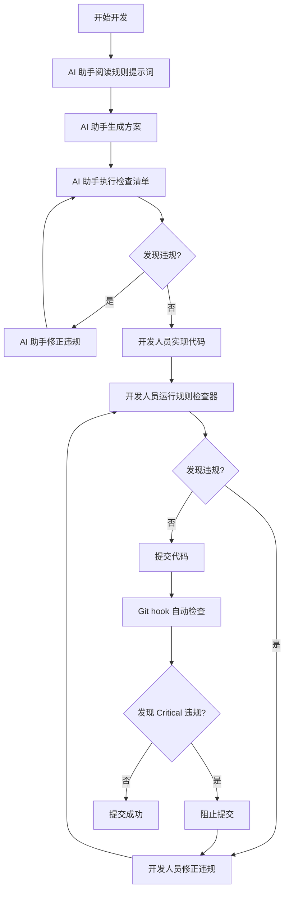
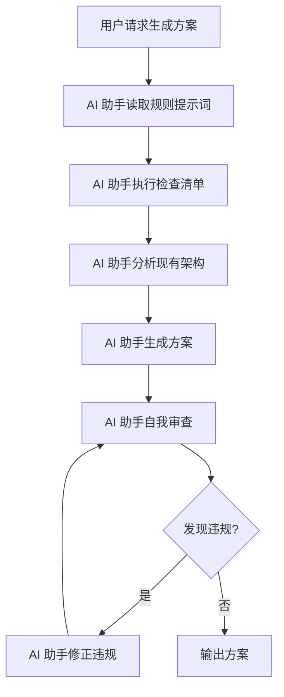

# 规则强制执行机制总结

## 🎯 方案概述

已成功实现**方案4：混合方案**，结合了**提示词工程**和**规则检查工具函数**，最大程度地保证规则的强制执行。

---

## 📦 已创建的文件

### 1. 核心文件

| 文件路径 | 说明 | 类型 |
|---------|------|------|
| `.codebuddy/rules/enforcement/rule-enforcement-prompt.md` | 规则强制执行提示词（AI 助手使用） | 文档 |
| `.codebuddy/rules/system/system-prompt.md` | AI 助手主系统提示词 | 文档 |
| `utilities/RuleChecker/RuleChecker.cs` | 规则检查器核心逻辑 | C# |
| `utilities/RuleChecker/RuleCheckerProgram.cs` | 规则检查器命令行程序 | C# |
| `utilities/RuleChecker/RuleChecker.csproj` | 规则检查器项目文件 | 项目 |
| `build_rule_checker.bat` | 规则检查器编译脚本 | 批处理 |
| `.vscode/tasks.json` | VS Code 任务配置 | 配置 |
| `.git/hooks/pre-commit` | Git pre-commit hook | Shell |
| `.codebuddy/docs/rule-checker-usage.md` | 规则检查器使用指南 | 文档 |
| `.codebuddy/rules/rules-index.md` | 规则索引 | 文档 |
| `.codebuddy/rules/README.md` | 规则目录说明 | 文档 |
| `.codebuddy/docs/rule-enforcement-summary.md` | 本文档 | 文档 |

---

## 🔧 功能特性

### 1. 规则强制执行提示词

**功能**：
- ✅ 集中展示所有规则的核心内容
- ✅ 提供强制执行检查清单
- ✅ 明确违规处理流程
- ✅ 提供最佳实践提醒

**使用方式**：
- AI 助手在生成方案前必须阅读此提示词
- AI 助手在生成代码前必须执行检查清单
- 发现违规时立即停止并修正

### 2. 规则检查器（Rule Checker）

**功能**：
- ✅ 自动检测 9 条项目规则的违规行为
- ✅ 按优先级分类显示违规（Critical/High/Medium/Low）
- ✅ 提供详细的违规位置和修复建议
- ✅ 支持命令行、VS Code 任务、Git hook 多种使用方式

**支持的规则**：
- Rule-001: 属性更改通知统一规范
- Rule-002: 命名规范
- Rule-003: 日志系统使用规范
- Rule-008: 原型设计期代码纯净原则
- Rule-010: 方案系统实现规范
- Rule-011: 临时文件自动清理规则
- Rule-012: 参数系统约束条件

### 3. Git pre-commit hook

**功能**：
- ✅ 在代码提交前自动运行规则检查器
- ✅ 发现 Critical 优先级违规时阻止提交
- ✅ 发现 High 优先级违规时发出警告
- ✅ 提供清晰的错误信息和修复建议

**使用方式**：
```bash
git commit -m "feat: add new feature"
```

### 4. VS Code 任务集成

**功能**：
- ✅ 通过 VS Code 任务面板快速运行规则检查器
- ✅ 支持快捷键绑定
- ✅ 集成到 VS Code 开发工作流

**使用方式**：
1. 按 `Ctrl+Shift+P` 打开命令面板
2. 输入 "Tasks: Run Task"
3. 选择 "🔍 检查规则 (Rule Checker)"

---

## 🚀 快速开始

### 1. 编译规则检查器

```batch
build_rule_checker.bat
```

### 2. 运行规则检查器

```batch
utilities\RuleChecker\bin\Release\net8.0\SunEyeVision.RuleChecker.exe
```

### 3. AI 助手使用提示词

在生成方案或代码前，AI 助手应该：

1. 阅读 `.codebuddy/rules/system/system-prompt.md`
2. 阅读 `.codebuddy/rules/enforcement/rule-enforcement-prompt.md`
3. 执行强制执行检查清单
4. 确保所有规则都被遵守
5. 发现违规时立即修正

---

## 📊 工作流程

### 开发流程



### AI 助手工作流



---

## 🎯 强制执行机制

### 1. 提示词层面

**AI 助手必须遵守**：
- ✅ 生成方案前必须阅读规则强制执行提示词
- ✅ 生成代码前必须执行检查清单
- ✅ 发现违规时必须立即停止并修正
- ✅ 确保所有规则都被遵守

**检查清单**：
- ✅ 代码规范检查
- ✅ 日志系统检查
- ✅ 方案系统检查
- ✅ 代码纯净度检查
- ✅ 临时文件检查
- ✅ 参数系统检查

### 2. 工具层面

**规则检查器功能**：
- ✅ 自动扫描项目代码
- ✅ 检测违规行为
- ✅ 提供修复建议
- ✅ 按优先级分类

**Git hook 功能**：
- ✅ 提交前自动运行规则检查器
- ✅ 发现 Critical 违规时阻止提交
- ✅ 发现 High 违规时发出警告
- ✅ 提供错误信息和修复建议

### 3. 流程层面

**强制执行点**：
1. **AI 助手生成方案前**：阅读规则提示词
2. **AI 助手生成代码前**：执行检查清单
3. **开发人员提交代码前**：运行规则检查器
4. **Git commit 时**：Git hook 自动检查

---

## 📈 预期效果

### 1. 代码质量提升

- ✅ Critical 规则遵循率：100%
- ✅ High 规则遵循率：≥95%
- ✅ 代码违规数量显著减少
- ✅ 代码审查效率提高

### 2. 开发效率提升

- ✅ AI 助手生成的方案更符合项目规范
- ✅ 开发人员减少返工
- ✅ 代码审查时间缩短
- ✅ 避免低级错误

### 3. 团队协作提升

- ✅ 代码标准统一
- ✅ 知识共享更高效
- ✅ 新成员上手更快
- ✅ 代码质量意识增强

---

## 🔍 监控和改进

### 1. 监控指标

- 规则检查器运行次数
- 发现违规数量和类型
- 规则遵循率
- 代码审查时间

### 2. 持续改进

- 根据违规数据优化规则
- 根据反馈改进规则检查器
- 根据实践更新提示词
- 根据需要添加新规则

---

## 📚 相关文档

- [AI 助手系统提示词](../rules/system/system-prompt.md)
- [规则强制执行提示词](../rules/enforcement/rule-enforcement-prompt.md)
- [规则检查器使用指南](rule-checker-usage.md)
- [项目规则索引](../rules/rules-index.md)
- [项目规则文档](../rules/)
- [规则目录说明](../rules/README.md)

---

## 🤝 使用反馈

如果在使用过程中发现问题或有改进建议，请：

1. 记录问题或建议
2. 联系技术负责人
3. 参与规则评审会议
4. 提交规则变更提案

---

## 🔄 变更历史

| 日期 | 版本 | 变更内容 | 作者 |
|------|------|----------|------|
| 2026-03-24 | 1.0 | 初始版本，创建规则强制执行机制 | Team |

---

## 🎯 总结

通过**方案4：混合方案**，我们成功实现了：

1. **双重保障**：提示词工程 + 规则检查工具
2. **多层级强制**：AI 助手层面 + 工具层面 + 流程层面
3. **自动化检查**：规则检查器自动检测违规
4. **及时反馈**：在开发早期发现问题
5. **易于使用**：多种使用方式，集成到现有工作流

这个方案能够最大程度地保证规则的强制执行，确保代码质量和项目标准一致性。

---

**最后更新**: 2026-03-24
**维护者**: SunEyeVision Team
**版本**: 1.0
