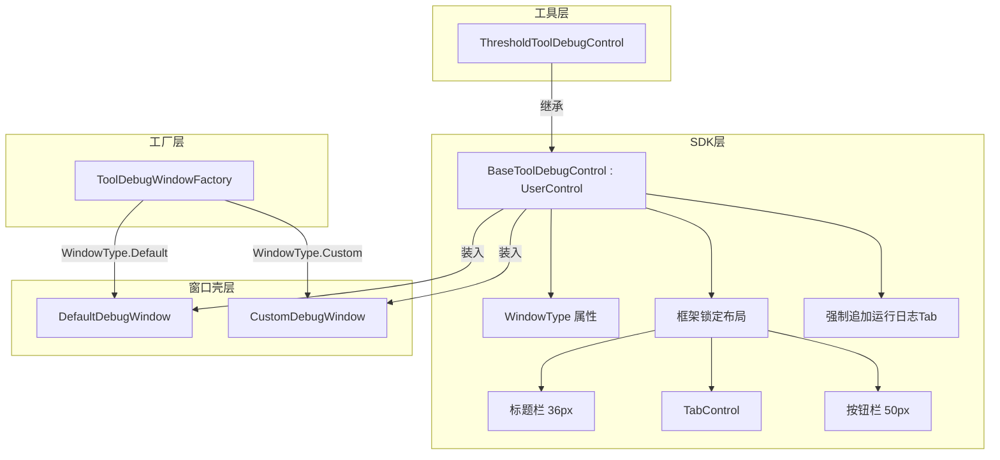

## 需求概述

实施 BaseToolDebugControl 最终优化方案，解决以下问题：

1. **设计器预览问题** - Window版本无法在VS设计器预览，工具层XAML只能盲写
2. **框架UI不统一** - UserControl版本缺少框架锁定，工具层UI风格不统一
3. **窗口类型手动判断** - 需要手动判断窗口类型，扩展性差

## 核心功能

### SDK层改造

- 增强 BaseToolDebugControl：添加 WindowType 属性、框架锁定布局（标题栏+TabControl+按钮栏）、强制追加运行日志Tab
- 创建轻量窗口壳：DefaultDebugWindow（普通窗口）和 CustomDebugWindow（无边框窗口）
- 创建泛型版本：BaseToolDebugControl.Generic.cs
- 删除废弃代码：BaseToolDebugWindow.xaml.cs 和 BaseToolDebugWindow.Generic.cs

### UI层改造

- 优化 ToolDebugWindowFactory：根据 WindowType 自动选择窗口壳

### 工具层迁移

- ThresholdTool：从 Window 版本迁移到 UserControl 版本

## 视觉效果

- 工具层 XAML 可在 VS 设计器实时预览
- 所有工具窗口风格统一（标题栏、按钮栏、日志Tab）
- 特殊工具可设置 WindowType.Custom 使用无边框窗口

## 技术栈选择

| 组件 | 技术 | 原因 |
| --- | --- | --- |
| 基类类型 | UserControl | 支持设计器预览，解决WPF继承限制 |
| 属性命名 | Tabs | 已广泛使用，避免迁移成本 |
| 限制策略 | 弱提示（日志警告） | 避免过度限制灵活性 |
| 窗口创建 | 工厂模式 + 自动识别 | 统一入口，简化工具层 |


## 架构设计



## 实现方案

### 1. WindowType 枚举定义

```
public enum WindowType
{
    Default,  // 普通窗口
    Custom    // 无边框窗口
}
```

### 2. BaseToolDebugControl 增强要点

- 添加 `WindowType` 属性（默认 Default）
- 创建三行 Grid 布局：标题栏(36px) + TabControl(*) + 按钮栏(50px)
- 强制追加"运行日志"Tab（不可删除）
- 保留 Tabs 属性名（已广泛使用）

### 3. 窗口壳设计

**DefaultDebugWindow**：普通窗口壳，与原 BaseToolDebugWindow 样式一致
**CustomDebugWindow**：无边框窗口壳，圆角边框，适用于脚本、计算器等特殊工具

### 4. 工厂自动识别

```
Window window = control.WindowType switch
{
    WindowType.Custom => new CustomDebugWindow(control),
    _ => new DefaultDebugWindow(control)
};
```

## 目录结构

```
src/Plugin.SDK/UI/
├── BaseToolDebugControl.cs          # [MODIFY] 增强框架锁定布局
├── BaseToolDebugControl.Generic.cs  # [NEW] 泛型版本
├── BaseToolDebugWindow.xaml.cs      # [DELETE] 废弃
├── BaseToolDebugWindow.Generic.cs   # [DELETE] 废弃
└── Windows/
    ├── DefaultDebugWindow.cs        # [NEW] 普通窗口壳
    └── CustomDebugWindow.cs         # [NEW] 无边框窗口壳

src/UI/Infrastructure/
└── ToolDebugWindowFactory.cs        # [MODIFY] 自动识别窗口类型

tools/SunEyeVision.Tool.Threshold/Views/
├── ThresholdToolDebugWindow.xaml    # [DELETE] 迁移到 UserControl
├── ThresholdToolDebugWindow.xaml.cs # [DELETE] 迁移到 UserControl
├── ThresholdToolDebugControl.xaml   # [NEW] UserControl 版本
└── ThresholdToolDebugControl.xaml.cs # [NEW] UserControl 版本
```

## 设计约束（基于规则）

| 规则 | 约束 |
| --- | --- |
| rule-008 | 不考虑向后兼容，直接删除旧代码 |
| rule-003 | 使用 PluginLogger，禁止 Debug.WriteLine |
| rule-002 | 使用 PascalCase，避免缩写 |


## Agent Extensions

### Skill

- **code-legacy-cleanup**
- Purpose: 清理废弃的 Window 版本基类代码（BaseToolDebugWindow.xaml.cs、BaseToolDebugWindow.Generic.cs）
- Expected outcome: 删除废弃代码，保持代码库纯净