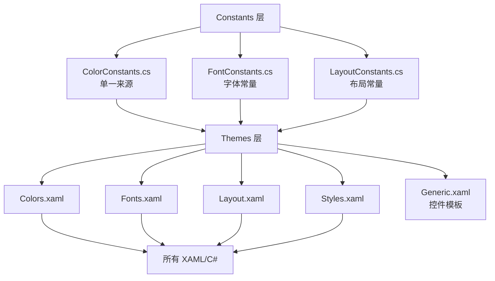

## 产品概述

完成 Plugin.SDK/UI 层的完整基础设施优化，包括颜色、字体、布局、样式四个维度，通过单一来源原则和编译时验证机制，确保所有样式出处完全一致。

## 核心功能

1. **颜色系统**（已完成）：ColorConstants.cs + Colors.xaml，单一来源，编译时验证
2. **字体系统**：FontConstants.cs + Fonts.xaml，统一字体大小、字重、字体族
3. **布局系统**：LayoutConstants.cs + Layout.xaml，统一尺寸、间距、边距
4. **样式系统**：Styles.xaml，提取通用样式，避免重复定义
5. **代码清理**：删除旧代码（ThemeColorPalette.cs），替换所有硬编码值

## 技术栈选择

- **常量定义层**：C# 静态常量类（单一来源）
- **资源层**：XAML ResourceDictionary（x:Static 引用）
- **编译时验证**：C# const + readonly + XAML x:Static
- **构建时验证**：PowerShell 脚本检测硬编码值

## 技术栈选择

- **常量定义**：C# 静态类 + const/readonly 字段
- **XAML 引用**：x:Static 标记扩展
- **性能优化**：Freeze() 冻结画笔
- **构建验证**：PowerShell 脚本

## 实施方案

### 架构设计：分层常量系统



### 目录结构（最终目标）

```
src/Plugin.SDK/UI/
├── Constants/                      # 常量定义层
│   ├── ColorConstants.cs          # ✅ 已创建
│   ├── FontConstants.cs           # ❌ 待创建
│   └── LayoutConstants.cs         # ❌ 待创建
│
├── Themes/                         # 主题资源层
│   ├── Colors.xaml                # ✅ 已创建
│   ├── Fonts.xaml                 # ❌ 待创建
│   ├── Layout.xaml                # ❌ 待创建
│   ├── Styles.xaml                # ❌ 待创建
│   ├── Generic.xaml               # ⚠️ 需更新
│   └── ThemeColorPalette.cs       # ❌ 待删除
│
├── Controls/                       # 控件层（已存在）
├── Windows/                        # 窗口壳层（已存在）
├── BaseToolDebugControl.cs        # 调试控件基类
├── BaseToolDebugControl.Generic.cs # 泛型版本
└── IToolDebugPanel.cs             # 接口定义
```

### 实施要点

#### 1. 字体常量设计

```
// FontConstants.cs 示例
public static class FontConstants
{
    // 字体大小
    public const double SizeTitle = 16;
    public const double SizeHeading = 14;
    public const double SizeBody = 13;
    public const double SizeCaption = 12;
    public const double SizeSmall = 11;
    
    // 字体族
    public const string FamilyDefault = "Microsoft YaHei UI";
    public const string FamilyMono = "Consolas";
    
    // 字重
    public static FontWeight WeightNormal => FontWeights.Normal;
    public static FontWeight WeightMedium => FontWeights.Medium;
    public static FontWeight WeightBold => FontWeights.Bold;
}
```

#### 2. 布局常量设计

```
// LayoutConstants.cs 示例
public static class LayoutConstants
{
    // 控件高度
    public const double ControlHeightSmall = 24;
    public const double ControlHeightMedium = 28;
    public const double ControlHeightLarge = 32;
    public const double ControlHeightXLarge = 36;
    
    // 间距
    public const double SpacingXSmall = 4;
    public const double SpacingSmall = 8;
    public const double SpacingMedium = 12;
    public const double SpacingLarge = 16;
    public const double SpacingXLarge = 24;
    
    // 圆角
    public const double CornerRadiusSmall = 2;
    public const double CornerRadiusMedium = 4;
    public const double CornerRadiusLarge = 8;
}
```

#### 3. Generic.xaml 更新策略

**当前问题**：

- Generic.xaml 中硬编码了 PrimaryBrush 等颜色（第18-25行）
- 大量 FontSize="13"、FontSize="12" 硬编码
- 大量 Height="28"、Margin="0,0,0,8" 硬编码

**解决方案**：

```xml
<!-- 引用 Colors.xaml -->
<ResourceDictionary.MergedDictionaries>
    <ResourceDictionary Source="Colors.xaml"/>
    <ResourceDictionary Source="Fonts.xaml"/>
    <ResourceDictionary Source="Layout.xaml"/>
</ResourceDictionary.MergedDictionaries>

<!-- 使用常量 -->
<Style TargetType="TextBlock" x:Key="LabelStyle">
    <Setter Property="FontSize" Value="{x:Static constants:FontConstants.SizeBody}"/>
    <Setter Property="Foreground" Value="{StaticResource TextPrimaryBrush}"/>
</Style>
```

### 性能考虑

- 使用 `Freeze()` 冻结画笔，避免重复创建
- 资源加载顺序：Colors.xaml → Fonts.xaml → Layout.xaml → Styles.xaml → Generic.xaml
- 编译时绑定，无运行时查找开销

### 日志规范

- 遵循 rule-003：使用项目日志系统
- 禁止使用 `Debug.WriteLine`
- 替换过程中使用 `LogInfo`/`LogSuccess` 记录进度

## Skill

- **code-legacy-cleanup**
- Purpose: 清理废弃的 ThemeColorPalette.cs 文件和 Generic.xaml 中的硬编码值
- Expected outcome: 删除旧代码，替换所有硬编码值为常量引用