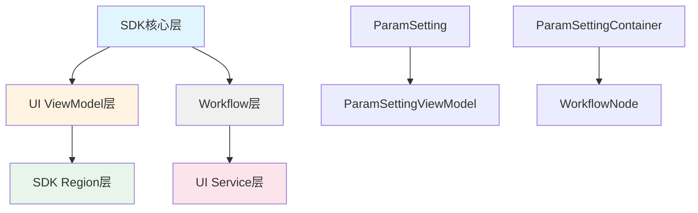

## 产品概述

将参数绑定系统从 ParameterBinding 重命名为 ParamSetting，使命名更准确反映"参数设置"功能，符合视觉软件简洁风格。

## 核心功能

- 重命名核心模型类：ParameterBinding → ParamSetting，ParameterBindingContainer → ParamSettingContainer
- 重命名 ViewModel 类：ParameterBindingViewModel → ParamSettingViewModel，ImageParameterBindingViewModel → ImageParamSettingViewModel
- 重命名 Region 层类：ParameterBindingItem → ParamSettingItem
- 保持 WPF 控件不变：BindableParameter 继续使用
- 更新所有引用和序列化逻辑

## 实施范围

- SDK 核心层：ParameterBinding.cs, ParameterBindingContainer.cs
- SDK 控件层：BindableParameter.cs（方法更新）
- UI ViewModel层：ParameterBindingViewModel.cs, ImageParameterBindingViewModel.cs, ToolViewModelBase.cs
- SDK Region层：ParameterBindingItem.cs, ParameterPanel.xaml
- Workflow层：WorkflowNode.cs, AlgorithmNode.cs
- UI Service层：命名空间重命名

## 技术栈选择

- 开发语言：C# (.NET 9.0)
- UI框架：WPF
- 序列化：System.Text.Json
- 遵循规范：命名规范（rule-002）、日志规范（rule-003）、文件编码规范（rule-013）、原型设计期代码纯净原则（rule-008）

## 技术方案

### 重命名策略

采用**直接删除旧代码**策略，不保留兼容层，遵循原型设计期代码纯净原则（rule-008）。使用文件重命名+内容替换方式，确保所有引用同步更新。

### 分阶段实施

#### 阶段1：SDK 核心模型层

**修改文件**：

1. `src/Plugin.SDK/Execution/Parameters/ParameterBinding.cs` → 重命名为 `ParamSetting.cs`

- 类名从 `ParameterBinding` 改为 `ParamSetting`
- 更新 XML 注释和文档

2. `src/Plugin.SDK/Execution/Parameters/ParameterBindingContainer.cs` → 重命名为 `ParamSettingContainer.cs`

- 类名从 `ParameterBindingContainer` 改为 `ParamSettingContainer`
- 字段 `_bindings` → `_settings`
- 属性 `Bindings` → `Settings`
- 方法参数和返回值类型更新

3. `src/Plugin.SDK/UI/Controls/BindableParameter.cs`

- 方法 `ToParameterBinding()` → `ToParamSetting()`
- 方法 `FromParameterBinding(ParameterBinding binding)` → `FromParamSetting(ParamSetting setting)`
- 返回值类型更新

#### 阶段2：UI ViewModel 层

**修改文件**：

1. `src/UI/ViewModels/ParameterBindingViewModel.cs` → 重命名为 `ParamSettingViewModel.cs`

- 类名从 `ParameterBindingViewModel` 改为 `ParamSettingViewModel`
- 基类从 `ParameterBindingViewModelBase` 改为 `ParamSettingViewModelBase`
- 字段 `_binding` → `_setting`
- 方法 `GetBinding()` → `GetSetting()`
- 静态方法 `FromBinding()` → `FromSetting()`

2. `src/UI/ViewModels/ImageParameterBindingViewModel.cs` → 重命名为 `ImageParamSettingViewModel.cs`

- 类名从 `ImageParameterBindingViewModel` 改为 `ImageParamSettingViewModel`
- 字段和方法更新同上

3. `src/UI/ViewModels/ToolViewModelBase.cs`

- 基类 `ParameterBindingViewModelBase` → `ParamSettingViewModelBase`
- 集合属性 `ParameterBindings` → `ParameterSettings`
- 方法 `CreateStandardParameterBinding()` → `CreateStandardParamSetting()`
- 方法 `CreateImageParameterBinding()` → `CreateImageParamSetting()`

#### 阶段3：SDK Region 层

**修改文件**：

1. `src/Plugin.SDK/UI/Controls/Region/Models/ParameterBindingItem.cs` → 重命名为 `ParamSettingItem.cs`

- 类名从 `ParameterBindingItem` 改为 `ParamSettingItem`

2. `src/Plugin.SDK/UI/Controls/Region/Views/ParameterPanel.xaml.cs`

- 更新 `ParameterBindingItem` 引用为 `ParamSettingItem`

3. `src/Plugin.SDK/UI/Controls/Region/ViewModels/ParameterPanelViewModel.cs`

- 更新集合属性引用

4. `src/Plugin.SDK/UI/Controls/Region/ViewModels/RegionEditorViewModel.cs`

- 更新属性引用 `ParameterBindings` → `ParameterSettings`

#### 阶段4：Workflow 层和 Service 层

**修改文件**：

1. `src/Workflow/WorkflowNode.cs`

- 属性 `ParameterBindings` → `ParameterSettings`
- 类型从 `ParameterBindingContainer` 改为 `ParamSettingContainer`

2. `src/Workflow/AlgorithmNode.cs`

- 参数解析逻辑中的类型引用更新

3. `src/UI/Services/ParameterBinding/ImageDataSourceService.cs`

- 命名空间从 `SunEyeVision.UI.Services.ParameterBinding` 改为 `SunEyeVision.UI.Services.ParameterSetting`
- 目录重命名：`src/UI/Services/ParameterBinding/` → `src/UI/Services/ParameterSetting/`

### 序列化兼容性处理

保持 JSON 序列化格式兼容：

- 类型标识符 `$type` 字段保持不变
- 属性名保持 PascalCase（符合 rule-010）
- 更新 `[JsonDerivedType]` 特性中的类型名称

### 性能考虑

- 重命名操作不影响运行时性能
- 序列化/反序列化逻辑保持不变
- 字典查找性能不受影响

## 实施细节

### 文件编码处理

遵循文件编码规范（rule-013），优先使用 `replace_in_file` 工具，如果失败则使用 PowerShell 脚本配合 UTF-8 无 BOM 编码。

### 日志记录

遵循日志系统规范（rule-003），在重命名过程中使用 `LogInfo()`、`LogSuccess()`、`LogError()` 记录关键操作。

### 命名规范

遵循命名规范（rule-002）：

- 类名使用 PascalCase：`ParamSetting`、`ParamSettingContainer`
- 属性使用 PascalCase：`ParameterSettings`
- 方法使用 PascalCase：`GetSetting()`、`ApplySetting()`
- 私有字段使用 _ + camelCase：`_setting`

## 架构设计

### 重命名影响图



### 数据流变化

```
旧流程：ParameterBinding → ParameterBindingContainer → WorkflowNode.ParameterBindings
新流程：ParamSetting → ParamSettingContainer → WorkflowNode.ParameterSettings
```

## 目录结构

### SDK 核心层文件变更

```
src/Plugin.SDK/Execution/Parameters/
├── ParameterBinding.cs           [DELETE] 删除旧文件
├── ParameterBindingContainer.cs  [DELETE] 删除旧文件
├── ParamSetting.cs               [NEW] 新参数设置模型类
├── ParamSettingContainer.cs     [NEW] 新参数设置容器类
└── BindingType.cs               [KEEP] 保持不变
```

### UI ViewModel 层文件变更

```
src/UI/ViewModels/
├── ParameterBindingViewModel.cs          [DELETE] 删除旧文件
├── ImageParameterBindingViewModel.cs     [DELETE] 删除旧文件
├── ParamSettingViewModel.cs              [NEW] 新参数设置ViewModel
├── ImageParamSettingViewModel.cs         [NEW] 新图像参数设置ViewModel
└── ToolViewModelBase.cs                  [MODIFY] 更新基类和集合属性
```

### SDK Region 层文件变更

```
src/Plugin.SDK/UI/Controls/Region/Models/
├── ParameterBindingItem.cs    [DELETE] 删除旧文件
└── ParamSettingItem.cs        [NEW] 新参数设置项

src/Plugin.SDK/UI/Controls/Region/Views/
└── ParameterPanel.xaml.cs     [MODIFY] 更新类型引用

src/Plugin.SDK/UI/Controls/Region/ViewModels/
├── ParameterPanelViewModel.cs   [MODIFY] 更新集合引用
└── RegionEditorViewModel.cs     [MODIFY] 更新属性引用
```

### Workflow 层文件变更

```
src/Workflow/
├── WorkflowNode.cs     [MODIFY] 更新属性类型和名称
└── AlgorithmNode.cs    [MODIFY] 更新参数解析逻辑
```

### UI Service 层文件变更

```
src/UI/Services/
├── ParameterBinding/           [DELETE] 删除旧目录
│   └── ImageDataSourceService.cs
└── ParameterSetting/           [NEW] 新目录
    └── ImageDataSourceService.cs  [NEW] 新命名空间
```

### SDK 控件层文件变更

```
src/Plugin.SDK/UI/Controls/
└── BindableParameter.cs  [MODIFY] 更新转换方法，文件名保持不变
```

## 关键代码结构

### ParamSetting 核心接口

```
/// <summary>
/// 参数设置模型
/// </summary>
public class ParamSetting
{
    public string ParameterName { get; set; }
    public BindingType BindingType { get; set; }
    public object? ConstantValue { get; set; }
    public string? SourceNodeId { get; set; }
    public string? SourceProperty { get; set; }
    
    public static ParamSetting CreateConstant(string parameterName, object? value);
    public static ParamSetting CreateBinding(string parameterName, string sourceNodeId, string sourceProperty, string? transformExpression = null);
}
```

### ParamSettingContainer 核心接口

```
/// <summary>
/// 参数设置容器
/// </summary>
public class ParamSettingContainer
{
    private readonly Dictionary<string, ParamSetting> _settings;
    public IEnumerable<ParamSetting> Settings { get; }
    
    public void SetSetting(ParamSetting setting);
    public ParamSetting? GetSetting(string parameterName);
    public void SetConstantSetting(string parameterName, object? value);
    public void SetDynamicSetting(string parameterName, string sourceNodeId, string sourceProperty, string? transformExpression = null);
}
```

### ViewModel 基类接口

```
/// <summary>
/// 参数设置 ViewModel 基类
/// </summary>
public abstract class ParamSettingViewModelBase : ViewModelBase
{
    public abstract ParamSetting GetSetting();
    public abstract void ApplySetting();
    protected void RaiseSettingChanged(ParamSetting setting);
}
```

## Agent Extensions

### SubAgent

- **code-explorer**
- Purpose: 搜索所有引用 ParameterBinding 的文件，确保重命名完整性
- Expected outcome: 生成完整的文件引用列表，避免遗漏