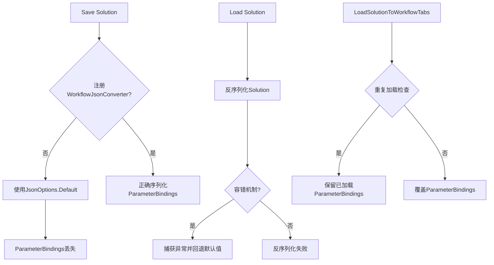

## Product Overview

修复参数绑定同步与反序列化容错机制的完整方案，解决三个核心问题导致的ParameterBindings丢失和覆盖问题。

## Core Features

- 在SolutionRepository中正确注册WorkflowJsonConverter，确保Solution序列化/反序列化时保留ParameterBindings
- 修复MainWindowViewModel.LoadSolutionToWorkflowTabs中的重复加载逻辑，避免覆盖已加载的ParameterBindings
- 增强反序列化容错机制，添加try-catch异常处理和默认值回退策略
- 确保Workflow节点的ParameterBindings在完整生命周期中保持一致性

## Tech Stack

- **框架**: .NET (C#)
- **序列化**: System.Text.Json
- **架构模式**: MVVM (Model-View-ViewModel)

## Tech Architecture

### 系统架构

针对现有项目的修复方案，基于以下模块：

- **SolutionRepository**: 负责Solution的持久化存储
- **MainWindowViewModel**: 管理工作流标签页和参数绑定加载
- **WorkflowJsonConverter**: Workflow节点的自定义JSON转换器

### 修复流程



### Module Division

- **序列化配置模块**: 配置JsonSerializationOptions并注册WorkflowJsonConverter
- **存储模块修复**: 修改SolutionRepository的Save和Load方法使用正确的序列化选项
- **视图模型修复**: 优化MainWindowViewModel的LoadSolutionToWorkflowTabs方法逻辑
- **容错处理模块**: 添加反序列化异常处理和默认值回退机制

### Data Flow

1. **保存流程**: Solution → WorkflowJsonConverter处理ParameterBindings → JSON序列化 → 存储
2. **加载流程**: 读取 → JSON反序列化(含容错) → 还原ParameterBindings → 加载到WorkflowTabs(避免重复)

## Implementation Details

### 核心目录结构

```
d:/MyWork/SunEyeVision_Dev/
├── src/
│   ├── Services/
│   │   └── SolutionRepository.cs      # 修改: 注册WorkflowJsonConverter
│   ├── ViewModels/
│   │   └── MainWindowViewModel.cs    # 修改: 修复重复加载逻辑
│   ├── Converters/
│   │   └── WorkflowJsonConverter.cs  # 检查: 确认转换器实现
│   └── Utils/
│       └── SerializationHelper.cs   # 新增: 容错反序列化辅助类
```

### Key Code Structures

**SerializationHelper**: 提供安全的反序列化方法，包含异常处理和默认值回退

```
public static class SerializationHelper
{
    private static readonly JsonSerializerOptions Options = new JsonSerializerOptions
    {
        Converters = { new WorkflowJsonConverter() },
        PropertyNameCaseInsensitive = true
    };
    
    public static T DeserializeSafe<T>(string json, T defaultValue = default)
    {
        try
        {
            return JsonSerializer.Deserialize<T>(json, Options);
        }
        catch (Exception ex) when (ex is JsonException || ex is NotSupportedException)
        {
            return defaultValue;
        }
    }
}
```

**SolutionRepository修改点**:

```
private static readonly JsonSerializerOptions WorkflowOptions = new JsonSerializerOptions
{
    Converters = { new WorkflowJsonConverter() },
    WriteIndented = true
};

public void Save(Solution solution)
{
    var json = JsonSerializer.Serialize(solution, WorkflowOptions);
    File.WriteAllText(_filePath, json);
}

public Solution Load()
{
    var json = File.ReadAllText(_filePath);
    return SerializationHelper.DeserializeSafe<Solution>(json) ?? new Solution();
}
```

**MainWindowViewModel修改点**:

```
private void LoadSolutionToWorkflowTabs(Solution solution)
{
    // 检查是否已加载，避免重复
    if (_solutionLoaded) return;
    
    // 只加载一次ParameterBindings
    foreach (var workflow in solution.Workflows)
    {
        LoadWorkflowParameters(workflow);
    }
    
    _solutionLoaded = true;
}
```

### Technical Implementation Plan

1. **注册WorkflowJsonConverter**: 在SolutionRepository中创建配置了WorkflowJsonConverter的JsonSerializerOptions实例
2. **修复Save方法**: 使用自定义Options替换默认的JsonSerializationOptions.Default
3. **修复Load方法**: 使用容错反序列化方法，添加异常处理
4. **修复重复加载**: 在MainWindowViewModel中添加状态标记，避免重复调用LoadSolutionToWorkflowTabs
5. **单元验证**: 通过代码审查确认修改点正确实现

### Integration Points

- SolutionRepository与MainWindowViewModel之间的数据流
- WorkflowJsonConverter与System.Text.Json的集成
- 容错机制与现有错误处理体系的对接

## Technical Considerations

### Performance Optimization

- 静态缓存JsonSerializerOptions实例，避免重复创建
- 延迟加载大型Solution数据

### Security Measures

- 验证反序列化数据完整性
- 防止恶意JSON数据注入

### Scalability

- 支持未来扩展其他类型的Converter
- 容错机制可复用于其他反序列化场景

## Design Style

本任务为代码修复，不涉及UI设计变更，无需新增设计内容。