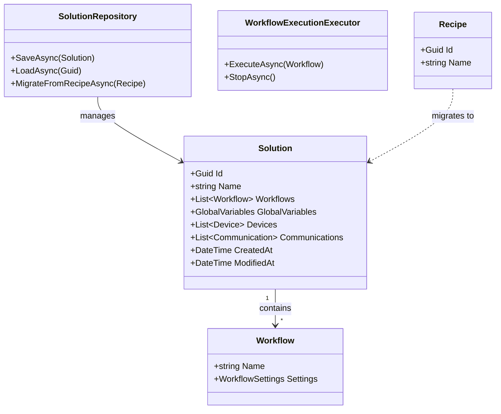
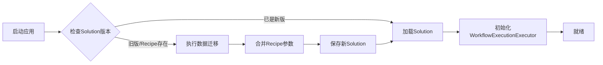

## Product Overview

对SunEyeVision项目架构进行深度重构，完全对齐VisionMaster标准架构，简化配置模型，统一命名规范，并提供平滑的数据迁移路径。

## Core Features

- **架构对齐重构**：彻底移除Recipe和RecipeGroup概念，简化为单一Solution模型，每个解决方案仅包含一套参数配置
- **命名规范优化**：
- `SolutionFile`重命名为`Solution`（核心实体）
- `WorkflowExecutionOrchestrator`重命名为`WorkflowExecutionExecutor`（UI.Services.Performance）
- `WorkflowFileRepository`优化为`WorkflowRepository`
- `SolutionFileRepository`优化为`SolutionRepository`
- **自动数据迁移**：实现将现有Recipe数据自动迁移并合并到Solution结构中的完整逻辑，确保历史数据无损转换
- **运行时配置清理**：从`RuntimeConfig`中移除`CurrentRecipe`和`RecentRecipes`相关属性，替换为`CurrentSolution`
- **引用链更新**：全局更新所有涉及旧命名的类、方法和XML序列化引用

## Tech Stack

- 语言：C# (.NET 6/7/8)
- 架构模式：分层架构 + 仓储模式

## Tech Architecture

### 系统架构

采用领域驱动设计（DDD）思想重构核心模型，保持UI层、服务层、数据层的清晰分离。



### 模块划分

#### 1. 核心领域模块

- **职责**：定义Solution、Workflow等核心实体及业务逻辑
- **主要接口**：
- `ISolutionRepository`: 解决方案的持久化操作
- `IWorkflowExecutor`: 工作流执行服务

#### 2. 数据迁移模块

- **职责**：处理从旧架构（Recipe）到新架构（Solution）的数据转换
- **主要功能**：
- 读取旧版Recipe文件
- 合并参数至Solution
- 备份原始数据
- 验证迁移完整性

#### 3. 运行时服务模块

- **职责**：替换旧的Orchestrator，提供工作流调度与执行能力
- **命名变更**：`WorkflowExecutionOrchestrator` -> `WorkflowExecutionExecutor`

### 数据流



## Implementation Details

### 核心目录结构

针对现有项目结构的修改与新增部分：

```
src/
├── Core/
│   ├── Entities/
│   │   ├── Solution.cs            # 重命名自 SolutionFile.cs
│   │   ├── Workflow.cs
│   │   └── GlobalVariables.cs
│   ├── Interfaces/
│   │   ├── ISolutionRepository.cs # 重命名接口定义
│   │   └── IWorkflowExecutor.cs   # 新增执行器接口
│   └── Services/
│       ├── SolutionRepository.cs  # 实现数据存取
│       └── DataMigrationService.cs # 新增：处理Recipe迁移
├── UI.Services.Performance/
│   └── WorkflowExecutionExecutor.cs  # 重命名自 Orchestrator
└── Runtime/
    └── RuntimeConfig.cs           # 修改：移除Recipe相关属性
```

### 关键代码结构

**Solution Entity (重命名自 SolutionFile)**:

```
public class Solution
{
    public Guid Id { get; set; }
    public string Name { get; set; }
    public List<Workflow> Workflows { get; set; }
    public GlobalVariables GlobalVariables { get; set; }
    // ... Devices, Communications 等属性保持不变
}
```

**Data Migration Logic**:

```
public class DataMigrationService
{
    public async Task<Solution> MigrateFromRecipeAsync(string recipePath)
    {
        // 1. 读取旧的Recipe数据
        // 2. 映射到新的Solution结构
        // 3. 合并所有RecipeGroup参数到Solution级别
        // 4. 返回新的Solution对象
    }
}
```

### 技术实施计划

1. **核心实体重构**

- **问题**：SolutionFile命名及Recipe概念冗余
- **方案**：重命名类，移除Recipe/RecipeGroup引用，将属性扁平化
- **步骤**：

    1. 创建新的`Solution.cs`
    2. 将`SolutionFile.cs`逻辑迁移并弃用原文件
    3. 更新所有引用点

2. **执行器重命名与重构**

- **问题**：Orchestrator命名不符合行业惯例
- **方案**：重命名类及内部依赖接口
- **步骤**：

    1. 重命名`WorkflowExecutionOrchestrator`为`WorkflowExecutionExecutor`
    2. 更新DI容器注册
    3. 全局查找替换引用

3. **数据迁移实现**

- **问题**：存量数据需要无损升级
- **方案**：实现一次性迁移脚本，检测旧格式自动触发
- **步骤**：

    1. 编写Recipe到Solution的映射逻辑
    2. 在应用启动时检测并执行迁移
    3. 验证迁移后数据的完整性

### 集成点

- **序列化**：XML配置文件结构变更，需兼容加载旧格式（通过迁移服务）
- **依赖注入**：更新`IServiceCollection`中的服务注册（Repository -> Executor）
- **UI绑定**：WPF/WinForm的数据绑定路径更新（e.g., `CurrentRecipe` -> `CurrentSolution`）

## Technical Considerations

### 性能优化

- 数据迁移采用异步流式处理，避免大文件阻塞UI
- 迁移过程增加进度反馈机制

### 安全措施

- 迁移前自动备份原始Recipe文件（后缀.bak）
- 迁移失败回滚机制

### 可扩展性

- 新架构支持未来添加Solution版本控制
- Executor接口设计便于接入分布式执行引擎

### Skill

- **skill-creator**
- Purpose: 用于创建本次架构优化所需的技能或脚本，辅助自动化重构过程
- Expected outcome: 生成可用于代码批量重命名和引用替换的辅助工具