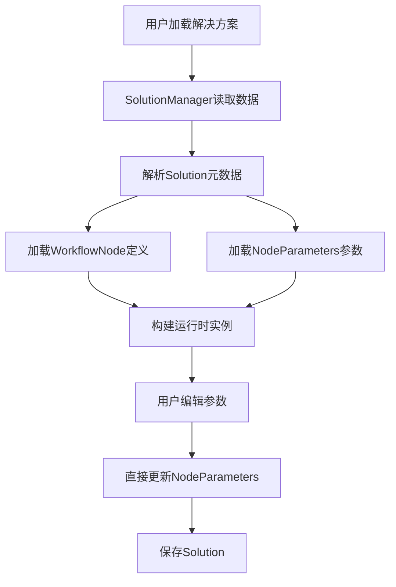

## 产品概述

将现有的多配方解决方案系统重构为单解决方案单参数系统，简化系统架构，移除配方管理功能，保留节点参数分离的设计模式，为后续数据同步优化打下基础。

## 核心功能

- 删除配方系统核心模块（Recipe、RecipeManager、ParameterSyncManager）
- 重构解决方案数据模型，移除配方关联逻辑
- 移除UI层的配方管理界面及命令
- 保持WorkflowNode元数据与Solution.NodeParameters实际数据分离
- 调整SolutionManager以适应单解决方案模式
- 更新数据导入导出逻辑以适配新结构

## 技术栈

- 开发语言：TypeScript
- 当前架构：基于TypeScript的模块化架构

## 架构设计

### 系统架构变更

- **变更前**：Solution包含多个Recipe，Recipe包含参数配置，ParameterSyncManager负责同步。
- **变更后**：Solution直接包含NodeParameters，移除中间层，参数直接绑定到解决方案。

### 模块划分

- **删除模块**：
- `Recipe.ts`：配方实体类
- `RecipeManager.ts`：配方管理逻辑
- `ParameterSyncManager.ts`：参数同步逻辑
- **修改模块**：
- `Solution.ts`：移除recipes属性，简化结构
- `SolutionManager.ts`：移除配方切换逻辑，简化加载保存流程
- **UI层**：
- 移除配方管理面板组件
- 移除配方切换相关命令

### 数据流变更



## 实现细节

### 核心目录结构变更

```
project-root/src/
├── core/
│   ├── models/
│   │   ├── Recipe.ts          # 待删除
│   │   ├── RecipeManager.ts   # 待删除
│   │   ├── Solution.ts        # 修改：移除配方相关逻辑
│   │   └── SolutionManager.ts # 修改：简化管理逻辑
│   └── sync/
│       └── ParameterSyncManager.ts # 待删除
├── ui/
│   ├── views/
│   │   └── RecipePanel.tsx    # 待删除
│   └── commands/
│       └── RecipeCommands.ts  # 待删除
```

### 关键代码结构调整

**Solution.ts**：移除`currentRecipeId`和`recipes`映射，直接通过`nodeParameters`存储数据。
**SolutionManager.ts**：移除`switchRecipe`方法，参数保存直接写入Solution实例。

### 技术实施计划

1. **清理旧代码**：识别并删除所有Recipe相关的类引用。
2. **数据迁移**：如果存在旧数据，需编写脚本将Recipe参数平铺到Solution.NodeParameters。
3. **引用重构**：全局搜索替换Recipe相关调用。

### 集成点

- 数据持久化层：确保Storage适配新的Solution结构。
- UI渲染层：移除配方选择器，参数编辑直接绑定NodeParameters。

## Agent Extensions

### Skill

- **code-legacy-cleanup**
- Purpose: 指导清理遗留的配方系统代码和废弃概念，重构为现代的单解决方案架构。
- Expected outcome: 移除Recipe、RecipeManager等遗留文件，清理相关引用，完成架构简化。