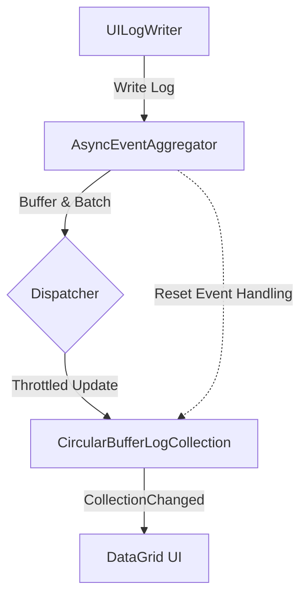

## Product Overview

修复日志系统中因CircularBufferLogCollection触发Reset事件导致DataGrid重新绑定时，UILogWriter同步触发LogsAdded事件引发的索引越界异常。通过引入事件聚合和异步处理机制，分阶段从短期防御性修复过渡到长期架构优化，彻底解决竞态条件问题。

## Core Features

- **防御性修复**: 在PropertyPanelControl中添加索引边界检查，防止直接崩溃。
- **事件聚合器**: 引入异步事件聚合机制，解耦日志生产与UI消费。
- **异步缓冲**: 实现日志数据的异步批量处理，避免UI线程阻塞。
- **架构重构**: 优化CircularBufferLogCollection与UILogWriter的交互模式。
- **状态监控**: 增加日志系统内部状态监控，便于追踪异常流。

## Tech Stack

- **Framework**: C# / .NET (WPF)
- **Core Libraries**: System.Collections.Concurrent, System.Threading.Tasks
- **Pattern**: Producer-Consumer, Observer Pattern

## Tech Architecture

### System Architecture

采用**生产者-消费者模式**重构日志系统，引入中间缓冲层来隔离日志写入（生产者）与UI展示（消费者）。通过异步队列处理日志事件，解决同步Reset事件与UI绑定之间的竞态条件。



### Module Division

- **Core/EventAggregator**: 负责日志事件的收集、节流和异步分发。
- **Collections/CircularBufferLogCollection**: 修改事件触发逻辑，依赖聚合器而非直接触发UI更新。
- **UI/PropertyPanelControl**: 添加防御性代码，确保数据访问安全。
- **Services/LogService**: 协调整个日志流转的中心服务。

### Data Flow

1. 日志产生 -> 进入异步队列
2. 聚合器批量处理 -> 触发CollectionChanged事件
3. UI接收到通知 -> 线程安全的UI更新
4. 异常捕获 -> 降级处理或重试机制

## Implementation Details

### Core Directory Structure

针对现有项目的修改和新增文件：

```
project-root/
├── src/
│   ├── Core/
│   │   └── EventAggregator.cs         # New: 异步事件聚合器实现
│   ├── Collections/
│   │   └── CircularBufferLogCollection.cs  # Modified: 修改Reset逻辑
│   ├── UI/
│   │   └── Controls/
│   │       └── PropertyPanelControl.xaml.cs # Modified: 添加边界检查
│   └── Services/
│       └── LogProcessingService.cs    # New: 日志处理服务
```

### Key Code Structures

**AsyncEventAggregator**: 核心组件，用于处理高频率日志事件的聚合与异步分发。

```
public class AsyncEventAggregator
{
    private readonly ConcurrentQueue<LogEntry> _logQueue;
    private readonly SemaphoreSlim _signal;

    public void Enqueue(LogEntry entry);
    private Task ProcessQueueAsync(); // 批量处理逻辑
}
```

**Safe DataGrid Access**: 在PropertyPanelControl中添加的安全访问包装。

```
// 在访问LogDataGrid.Items[Count-1]前进行防御性检查
if (LogDataGrid.Items.Count > 0) {
    var lastItem = LogDataGrid.Items[LogDataGrid.Items.Count - 1];
    // 业务逻辑...
}
```

### Technical Implementation Plan

1. **短期修复**: 在PropertyPanelControl第417行添加Try-Catch块和Count检查，立即防止崩溃。
2. **引入聚合器**: 创建AsyncEventAggregator类，使用ConcurrentQueue和Timer实现批处理。
3. **重构Collection**: 修改CircularBufferLogCollection，使其在缓冲区满时通知聚合器而非直接Reset。
4. **异步绑定**: 更新UILogWriter，使其将日志写入聚合器而非直接操作UI线程。
5. **测试验证**: 在高频日志场景下验证DataGrid不再出现索引越界。

### Integration Points

- **WPF Dispatcher**: 确保UI更新始终在主线程执行。
- **SynchronizationContext**: 用于跨线程通信，确保UI上下文正确。
- **Existing Interfaces**: 保持ILogWriter接口兼容性，内部实现替换为异步逻辑。

## Technical Considerations

### Performance Optimization

- **UI 节流**: 设置聚合器的批处理间隔（如100ms），避免DataGrid过度刷新。
- **虚拟化**: 确保DataGrid开启虚拟化，仅渲染可见项。

### Security Measures

- **线程安全**: 所有对UI集合的访问必须通过Dispatcher.Invoke或Dispatcher.BeginInvoke。

### Scalability

- **可扩展性**: 新的事件聚合器架构支持未来接入更多日志消费者（如文件写入、网络传输）。

## Agent Extensions

### Skill

- **code-legacy-cleanup**
- Purpose: 指导从旧式的同步事件绑定架构迁移到现代的异步聚合架构
- Expected outcome: 彻底清除导致索引越界的竞态条件代码，建立健壮的事件处理模型