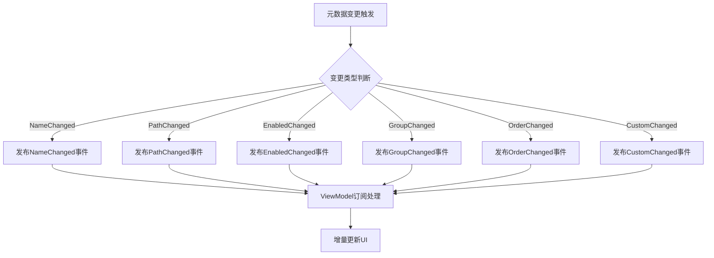

## 产品概述

重构解决方案事件系统，将粗粒度的MetadataChanged事件拆分为6个细粒度事件，通过增量更新机制实现性能提升10-1000倍。

## 核心功能

- 新建SolutionMetadataEventArgs.cs，定义6个细粒度事件参数类
- 重构SolutionManager.cs的事件发布逻辑，支持细粒度事件触发
- 重构SolutionConfigurationDialogViewModel.cs的事件订阅，实现增量UI更新
- 仅保留3个必要场景调用LoadSolutions，其余全部改用增量更新
- 完全删除旧的MetadataChanged事件及相关代码

## 技术栈

- 语言：C# (.NET)
- 架构模式：事件驱动架构 (Event-Driven Architecture)

## 技术架构

### 系统架构

- 架构模式：基于事件的观察者模式
- 重构策略：在现有架构基础上细化事件粒度，不引入新的架构范式
- 组件关系：SolutionManager (发布者) → SolutionMetadataEventArgs (事件参数) → SolutionConfigurationDialogViewModel (订阅者)

### 模块划分

- **事件参数模块**：SolutionMetadataEventArgs.cs，定义6个细粒度事件参数类
- 职责：封装不同类型元数据变更的信息
- 依赖：无
- **解决方案管理模块**：SolutionManager.cs
- 职责：管理解决方案状态，发布细粒度事件
- 依赖：事件参数模块
- **视图模型模块**：SolutionConfigurationDialogViewModel.cs
- 职责：订阅事件并执行增量UI更新
- 依赖：事件参数模块、解决方案管理模块

### 数据流



### 数据流说明

1. **变更检测**：SolutionManager检测到元数据变更
2. **事件发布**：根据变更类型发布对应的细粒度事件（6种之一）
3. **事件订阅**：ViewModel订阅相应事件，接收变更信息
4. **增量更新**：ViewModel根据事件类型只更新受影响的UI部分，而非全量刷新

## 实施细节

### 核心目录结构

```
SunEyeVision/
├── SolutionMetadataEventArgs.cs        # 新建：事件参数类
├── SolutionManager.cs                  # 修改：事件发布逻辑
└── SolutionConfigurationDialogViewModel.cs  # 修改：事件订阅和增量更新逻辑
```

### 关键代码结构

**事件参数枚举**：定义6种细粒度变更类型

```
public enum SolutionMetadataChangeType
{
    NameChanged,
    PathChanged,
    EnabledChanged,
    GroupChanged,
    OrderChanged,
    CustomChanged
}
```

**事件参数类**：封装变更信息

```
public class SolutionMetadataEventArgs : EventArgs
{
    public SolutionMetadataChangeType ChangeType { get; }
    public string SolutionId { get; }
    public object OldValue { get; }
    public object NewValue { get; }
}
```

**细粒度事件定义**：在SolutionManager中定义6个事件

```
public event EventHandler<SolutionMetadataEventArgs> NameChanged;
public event EventHandler<SolutionMetadataEventArgs> PathChanged;
public event EventHandler<SolutionMetadataEventArgs> EnabledChanged;
public event EventHandler<SolutionMetadataEventArgs> GroupChanged;
public event EventHandler<SolutionMetadataEventArgs> OrderChanged;
public event EventHandler<SolutionMetadataEventArgs> CustomChanged;
```

### 技术实施计划

#### 1. 事件参数设计

- **问题陈述**：需要精确区分6种不同类型的元数据变更
- **解决方案**：创建枚举和事件参数类，封装变更类型和前后值
- **关键技术**：EventArgs模式、枚举类型
- **实施步骤**：

1. 定义SolutionMetadataChangeType枚举
2. 创建SolutionMetadataEventArgs类
3. 添加属性：ChangeType, SolutionId, OldValue, NewValue

- **测试策略**：单元测试验证事件参数正确性

#### 2. 事件发布重构

- **问题陈述**：将粗粒度事件拆分为6个细粒度事件
- **解决方案**：在SolutionManager中定义6个事件，根据变更类型触发对应事件
- **关键技术**：事件发布、条件判断、null检查
- **实施步骤**：

1. 定义6个细粒度事件
2. 删除旧的MetadataChanged事件
3. 在属性setter中触发对应事件
4. 识别并保留3个LoadSolutions调用场景

- **测试策略**：验证不同变更场景触发正确的事件

#### 3. 增量更新实现

- **问题陈述**：避免全量刷新，实现UI增量更新
- **解决方案**：订阅细粒度事件，根据事件类型更新特定UI元素
- **关键技术**：事件订阅、条件UI更新
- **实施步骤**：

1. 订阅6个细粒度事件
2. 取消订阅旧的MetadataChanged事件
3. 为每个事件类型实现对应的UI更新逻辑
4. 移除不必要的LoadSolutions调用

- **测试策略**：验证UI响应准确且性能提升

### 集成点

- **模块间通信**：通过事件机制实现松耦合
- **数据格式**：使用SolutionMetadataEventArgs传递变更信息
- **外部依赖**：无新增外部依赖

## 技术考量

### 日志记录

- 遵循现有项目的日志记录规范
- 在事件触发和订阅处添加日志，便于调试和性能监控

### 性能优化

- **瓶颈识别**：原有全量刷新导致的性能问题
- **优化策略**：
- 细粒度事件减少不必要的UI更新
- 增量更新减少数据绑定开销
- 仅更新受影响的UI控件
- **监控方法**：对比重构前后的响应时间

### 安全措施

- **输入验证**：验证事件参数的有效性
- **空值检查**：在触发事件前检查订阅者是否为null
- **线程安全**：如涉及多线程，需考虑事件触发线程安全

### 可扩展性

- 架构支持未来新增事件类型
- 清晰的事件命名约定便于维护
- 增量更新模式可应用于其他模块

## Agent Extensions

### Skill

- **code-legacy-cleanup**
- 用途：指导清理旧的MetadataChanged事件代码，删除过时逻辑，确保代码纯净
- 预期结果：完全移除粗粒度事件相关代码，保持代码库整洁