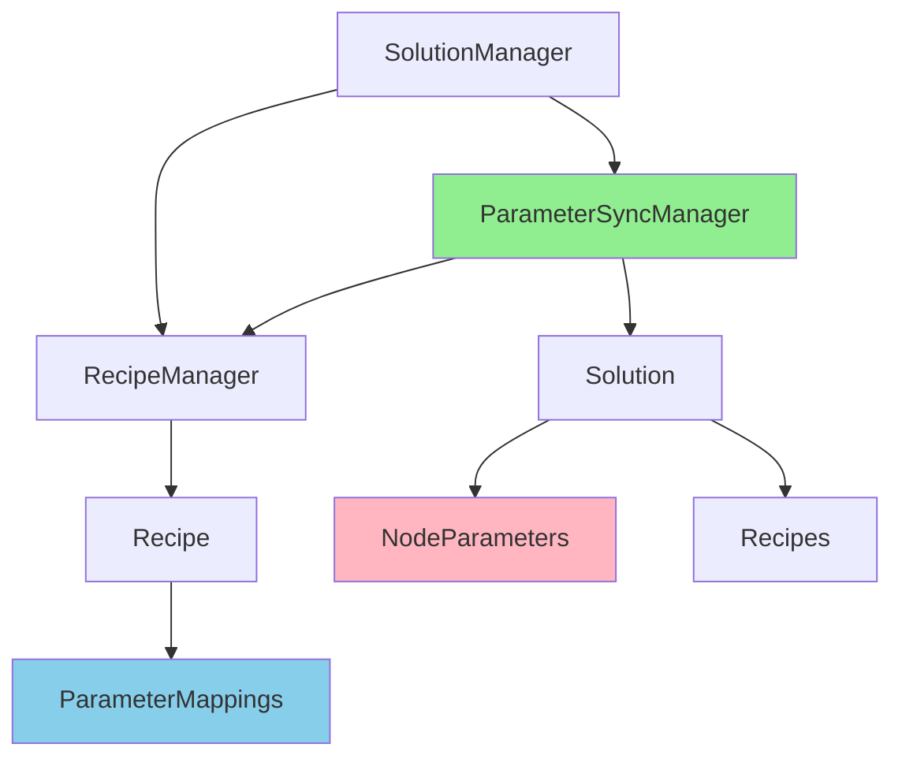

## 用户需求

根据"解决方案参数同步与保存机制优化方案-20260319.md"文档创建实施计划，实现解决方案系统的参数同步与保存机制优化。

## 产品概述

优化现有解决方案系统的参数同步和保存机制，引入 ParameterSyncManager 统一管理所有参数同步场景，确保 Recipe 和 NodeParameters 数据一致性，明确职责分工。

## 现有代码分析

### 已存在的方法

1. **SolutionManager.CreateNewSolution()** - ✅ 已存在

- 位置：`src/Workflow/SolutionManager.cs` 第171行
- 功能：创建新解决方案，调用 `Solution.CreateNew()`
- 状态：无需修改

2. **Solution.Create()** - ✅ 已存在，需重命名和改进

- 位置：`src/Workflow/Solution.cs` 第183行
- 原方法名：`CreateNew()`（需重命名为 `Create()`）
- 功能：创建解决方案实例
- 问题：
- 方法命名不规范（应改为 `Create()` 与项目其他类一致）
- 配方列表为空，没有创建默认配方
- 需要：
- 重命名为 `Create()`
- 添加默认配方创建逻辑

3. **RecipeManager** - ✅ 已存在

- 位置：`src/Workflow/RecipeManager.cs`
- 功能：配方管理器
- 需要：增强参数同步逻辑

### 需要新建的类

1. **ParameterSyncManager** - ❌ 不存在

- 位置：`src/Workflow/ParameterSyncManager.cs`（新建）
- 功能：统一管理所有参数同步场景

## 核心功能

1. **重命名并修改 Solution.Create()**：将 `CreateNew()` 重命名为 `Create()`，添加默认配方创建逻辑
2. **新建 ParameterSyncManager**：统一管理所有参数同步场景
3. **增强 RecipeManager**：添加参数同步逻辑
4. **集成 SolutionManager**：集成参数同步管理器，更新调用为 `Solution.Create()`
5. **节点生命周期同步**：添加/删除/克隆节点时自动同步参数
6. **配方切换同步**：切换配方时自动保存和应用参数

## 技术栈选择

- **语言**: C# / WPF
- **框架**: .NET 8.0
- **序列化**: System.Text.Json（多态序列化）
- **日志**: VisionLogger（项目现有）
- **MVVM**: ObservableObject（项目现有）

## 实施方案

### 核心架构设计



### 数据模型关系

- **Recipe**: 唯一参数源（持久化存储）
- **NodeParameters**: 运行时缓存（执行时使用）
- **ParameterSyncManager**: 同步控制器

### 关键技术决策

1. **配方是唯一参数源**

- 所有参数修改都保存到当前激活的配方
- NodeParameters 作为运行时缓存提高执行性能

2. **统一同步管理**

- ParameterSyncManager 集中管理所有同步场景
- 避免散落在各处的同步逻辑

3. **自动创建默认配方**

- 创建新解决方案时自动创建默认配方
- 加载解决方案时确保有激活的配方

## 目录结构

```
src/Workflow/
├── Solution.cs                    # [MODIFY] 修改现有 CreateNew() 方法，添加默认配方创建逻辑
├── SolutionManager.cs             # [MODIFY] 集成 ParameterSyncManager
├── Recipe.cs                      # [EXISTING] 配方模型（已实现，无需修改）
├── RecipeManager.cs               # [MODIFY] 增强配方切换时的参数同步
├── ParameterSyncManager.cs        # [NEW] 参数同步管理器（新建）
└── RecipeChangeType.cs            # [EXISTING] 配方变化类型枚举（无需修改）

src/UI/ViewModels/
├── MainWindowViewModel.cs         # [MODIFY] 集成节点生命周期同步
└── RecipeManagementDialogViewModel.cs  # [MODIFY] 配方管理界面集成同步

src/UI/Views/Windows/
├── RecipeManagementDialog.xaml    # [EXISTING] 配方管理对话框（无需修改）
└── RecipeManagementDialog.xaml.cs # [MODIFY] 集成参数同步
```

### 文件修改说明

| 文件 | 状态 | 修改内容 |
| --- | --- | --- |
| Solution.cs | 修改现有 | 重命名 `CreateNew()` 为 `Create()`，添加默认配方创建逻辑 |
| SolutionManager.cs | 修改现有 | 添加 `_parameterSyncManager` 字段，更新调用为 `Solution.Create()` |
| RecipeManager.cs | 修改现有 | 增强 `ActivateRecipe()` 方法，添加参数同步逻辑 |
| ParameterSyncManager.cs | 新建 | 创建完整的参数同步管理器类 |


## 关键代码结构

### ParameterSyncManager 接口定义

```
public class ParameterSyncManager
{
    // 构造函数
    public ParameterSyncManager(Solution solution, RecipeManager recipeManager);
    
    // 节点生命周期同步
    public void OnNodeAdded(string nodeId, Workflow workflow);
    public void OnNodeDeleted(string nodeId);
    public void OnNodeCloned(string oldNodeId, string newNodeId);
    public void OnNodeRenamed(string nodeId, string oldName, string newName);
    
    // 调试窗口同步
    public void OnNodeWindowClosing(string nodeId, ToolParameters parameters);
    
    // 配方切换同步
    public void OnRecipeSwitching(string? oldRecipeId, string newRecipeId);
    public void OnRecipeSwitched(string recipeId);
    
    // 工作流管理同步
    public void OnWorkflowAdded(Workflow workflow);
    public void OnWorkflowDeleted(Workflow workflow);
    
    // 解决方案保存/加载同步
    public void OnSolutionSaving();
    public void OnSolutionLoaded();
}
```

### Solution.CreateNew 方法（修改现有）

**现有实现问题**：

```
// 当前代码（src/Workflow/Solution.cs 第183行）
public static Solution CreateNew()
{
    return new Solution
    {
        Id = Guid.NewGuid().ToString(),
        Version = "1.0",
        Workflows = new List<Workflow>(),
        NodeParameters = new Dictionary<string, ToolParameters>(),
        GlobalVariables = new List<GlobalVariable>(),
        
        // ❌ 问题：配方列表为空，没有默认配方
        Recipes = new List<Recipe>(),
        DefaultRecipeId = null,
        CurrentRecipeId = null,
        
        // ... 其他属性
    };
}
```

**修改后的实现**：

```
public static Solution CreateNew()
{
    var solution = new Solution
    {
        Id = Guid.NewGuid().ToString(),
        Version = "1.0",
        Workflows = new List<Workflow>(),
        NodeParameters = new Dictionary<string, ToolParameters>(),
        GlobalVariables = new List<GlobalVariable>(),
        Recipes = new List<Recipe>(),  // 先初始化空列表
        Devices = new List<Device>(),
        Communications = new List<Communication>(),
        DatabaseConfiguration = new DatabaseConfiguration(),
        ExecutionStrategy = new ExecutionStrategy(),
        VersionHistory = new List<SolutionVersion>()
    };
    
    // ✅ 新增：自动创建默认配方
    var defaultRecipe = new Recipe
    {
        Name = "默认配方",
        Description = "默认参数配置",
        IsDefault = true,
        CreatedTime = DateTime.Now,
        LastModifiedTime = DateTime.Now
    };
    
    solution.Recipes.Add(defaultRecipe);
    solution.DefaultRecipeId = defaultRecipe.Id;
    solution.CurrentRecipeId = defaultRecipe.Id;
    
    return solution;
}
```

## Agent Extensions

### SubAgent

- **code-explorer**
- Purpose: 探索现有代码结构，确认 SolutionManager、WorkflowNode 等类的实现细节
- Expected outcome: 获取准确的代码结构和依赖关系，确保实施计划的准确性