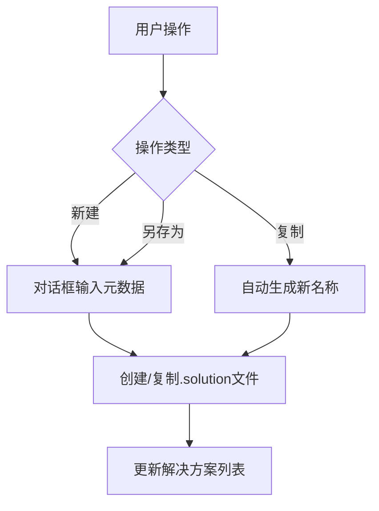

## Product Overview

优化现有解决方案管理系统，重构文件操作逻辑，实现文件级的新建、复制、另存为操作，删除过时代码，确保符合惰性加载原则。

## Core Features

- 文件级新建解决方案：创建 .solution 文件，基于元数据（对话框与元数据绑定）
- 文件级复制：自动生成新名称，直接文件复制，无需加载完整对象
- 文件级另存为：实现保存为新文件，避免完整对象加载
- 删除过时代码：移除 CreateSolution、ConfigFilePath 等废弃方法，移除冗余的 SaveSolutionAs
- 惰性加载：确保文件操作不加载完整 Solution 对象

## Tech Stack

基于现有项目架构进行重构，不引入新技术栈

## Tech Architecture

### 系统架构调整

- 文件操作层：独立于 Solution 对象模型，直接操作文件系统
- 元数据管理：通过对话框获取元数据，用于文件创建
- 惰性加载策略：文件操作只读取必要信息，不反序列化完整对象

### 模块划分

- **SolutionManager 重构模块**：实现文件级的新建、复制、另存为
- **文件操作模块**：提供文件复制、重命名、创建等底层操作
- **废弃代码清理模块**：识别并删除过时代码

### 数据流



## Implementation Details

### 核心文件修改

```
project-root/
├── src/
│   ├── managers/
│   │   └── SolutionManager.ts    # 重构：实现文件级操作
│   ├── services/
│   │   └── fileService.ts        # 新增/修改：文件操作服务
│   └── models/
│       └── Solution.ts           # 删除：废弃方法
```

### 关键代码结构

**文件级新建接口**：基于元数据创建解决方案文件，不依赖完整对象加载

```typescript
createSolutionFile(metadata: SolutionMetadata): Promise<string>
```

**文件级复制接口**：直接文件复制，自动生成新名称

```typescript
copySolutionFile(sourcePath: string): Promise<string>
```

**文件级另存为接口**：保存为新文件路径

```typescript
saveSolutionAsFile(sourcePath: string, newPath: string): Promise<void>
```

### 技术实施计划

1. **问题分析**：识别 CreateNewSolution、Copy、SaveAs 中的完整对象加载点
2. **重构策略**：将文件操作从 Solution 对象解耦，使用文件系统 API 直接操作
3. **惰性加载**：文件操作只读取路径和基本信息，避免反序列化
4. **代码清理**：使用静态分析识别废弃方法，彻底删除不考虑兼容

### 集成点

- SolutionManager 与文件系统服务的集成
- 对话框组件与元数据结构的集成
- 解决方案列表更新机制的集成

## Agent Extensions

### Skill

- **code-legacy-cleanup**
- Purpose: 清理过时的 CreateSolution、ConfigFilePath 方法和冗余的 SaveSolutionAs
- Expected outcome: 识别并彻底删除所有废弃代码，代码库整洁无冗余