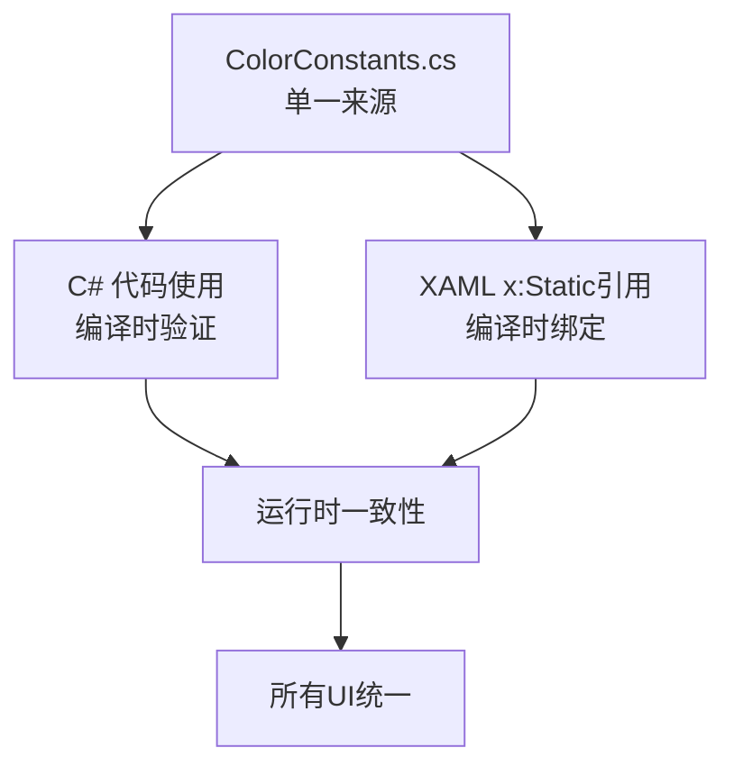

## 产品概述

项目样式统一优化方案，解决当前样式分散、颜色冲突、硬编码问题，确保所有样式出处完全一致

## 核心功能

1. 创建统一的颜色常量系统（单一来源原则）
2. 实现编译时验证机制（C#常量 + XAML x:Static绑定）
3. 替换所有硬编码颜色（C# 43+处，XAML 30+处）
4. 解决颜色定义冲突（PrimaryBrush定义3次，值不同）
5. 建立强制约束机制（构建时验证 + 代码审查）

## 技术栈选择

- **颜色系统**: C# 静态常量类 + XAML x:Static 引用
- **编译时验证**: C# const + readonly + XAML x:Static
- **运行时一致性**: 资源加载顺序控制
- **强制约束**: PowerShell 构建脚本 + 代码审查规则

## 实施方案

### 架构设计：单一来源 + 编译时验证



### 技术决策

#### 为什么不使用 HandyControl？

| 维度 | 自定义样式 | HandyControl | 决策 |
| --- | --- | --- | --- |
| 架构原则 | 零依赖 | 引入第三方依赖 | 自定义样式 |
| 性能 | 无额外开销 | 加载开销 | 自定义样式 |
| 原型期特性 | 代码纯净 | 锁定架构 | 自定义样式 |
| 维护成本 | 完全可控 | 依赖社区 | 自定义样式 |


### 核心文件结构

```
src/Plugin.SDK/UI/
├── Constants/                      
│   └── ColorConstants.cs          # 颜色常量（单一来源）
├── Themes/                         
│   ├── Colors.xaml                # 颜色资源
│   └── Generic.xaml               # 控件模板（删除重复定义）
└── BaseToolDebugControl.cs        # 调试控件基类（替换硬编码）

src/UI/
├── App.xaml                       # 更新资源加载顺序
├── Views/Resources/
│   └── AppResources.xaml          # 删除重复定义
└── Converters/                    # 替换硬编码颜色

scripts/
└── check_color_consistency.ps1    # 构建时验证脚本
```

## 实施要点

### 1. 单一来源原则

- 所有颜色值只在 `ColorConstants.cs` 定义
- XAML 通过 `x:Static` 引用常量
- C# 代码直接使用常量
- 修改一处，全局同步

### 2. 编译时验证

- C# 常量：编译时检查类型
- XAML x:Static：编译时检查存在性
- 避免运行时错误

### 3. 强制约束机制

- 构建时验证脚本：自动检测硬编码
- 代码审查规则：人工审核
- EditorConfig：静态分析配置

### 性能考虑

- 使用 `Freeze()` 冻结画笔，避免重复创建
- 资源加载顺序明确，避免运行时覆盖
- 编译时绑定，无运行时查找开销

### 日志规范

- 遵循 rule-003：使用项目日志系统
- 禁止使用 `Debug.WriteLine`
- 在 Converter 中使用 `LogInfo`/`LogError`

### 临时文件清理

- 遵循 rule-011：构建脚本输出到系统临时目录
- 使用 `$env:TEMP` 或 `[System.IO.Path]::GetTempFileName()`
- Try-Finally 确保清理

## Agent Extensions

### Skill

- **code-legacy-cleanup**
- Purpose: 清理废弃的颜色定义和硬编码颜色
- Expected outcome: 删除重复的 PrimaryBrush 定义，替换所有硬编码颜色为 ColorConstants 引用