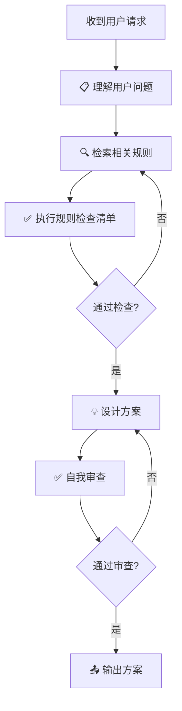

# 🤖 AI 助手系统提示词配置

> **目标**: 确保 AI 助手始终遵循项目规则和最佳实践
> **状态**: ✅ 已启用
> **版本**: 1.1
> **最后更新**: 2026-03-24

---

## 📋 概述

本项目已经建立了完整的 AI 助手系统提示词配置，确保 AI 助手在每次对话中都能自动遵循项目规则。

### 核心文件

| 文件 | 说明 |
|------|------|
| `system/system-prompt.md` | 主系统提示词文件（必须阅读） |
| `../config/system-prompt-loader.yaml` | 系统提示词加载配置 |
| `enforcement/rule-enforcement-prompt.md` | 规则强制执行提示词 |
| `templates/solution-design-template.md` | 方案设计思维模板 |
| `templates/rules-checklist.md` | 规则检查清单 |

---

## 🚨 强制执行机制

### 工作流程

AI 助手在收到用户请求时，会自动执行以下流程：



### 强制执行步骤

#### 1. 理解用户问题
- 识别用户的核心需求
- 识别涉及的文件和代码
- 识别问题的层级（UI/ViewModel/Service/Core/Plugin）
- 识别用户的期望结果

#### 2. 检索相关规则
- 根据问题类型搜索相关规则
- 使用 `read_rules` 工具读取规则详情
- 记录规则的核心要求
- 标记规则的优先级（Critical/High/Medium）

#### 3. 执行规则检查清单
- 代码规范检查（rule-001, rule-002）
- 日志系统检查（rule-003）
- 方案系统检查（rule-010）
- 代码纯净度检查（rule-008）
- 临时文件检查（rule-011）
- 参数系统检查（rule-012）

#### 4. 设计方案
- 明确方案的目标
- 列出所有涉及的规则
- 提供详细的实施步骤
- 为每个步骤说明遵循的规则
- 提供验证清单
- 识别潜在风险

#### 5. 自我审查
- 对照所有相关规则
- 明确标注遵循的规则
- 验证没有违反任何规则
- 验证方案质量
- 验证代码质量

---

## 📚 核心规则

### 🔴 CRITICAL 优先级规则

#### Rule-001: 属性更改通知统一规范
- ✅ 必须继承 `ObservableObject`
- ✅ 必须使用 `SetProperty` 方法
- ❌ 禁止直接实现 `INotifyPropertyChanged`

#### Rule-008: 原型设计期代码纯净原则
- ✅ 直接删除旧代码（不考虑向后兼容）
- ❌ 禁止使用 `[Obsolete]` 标记
- ❌ 禁止保留注释掉的代码

#### Rule-010: 方案系统实现规范
- ✅ 优先使用 `System.Text.Json` 的 `[JsonPolymorphic]` 特性
- ✅ 使用 PascalCase 命名
- ❌ 禁止使用 Newtonsoft.Json

### 🟠 HIGH 优先级规则

#### Rule-002: 命名规范
- ✅ 类名使用 PascalCase：`WorkflowEngine`
- ✅ 私有字段使用 `_camelCase`：`_threshold`
- ❌ 禁止使用缩写：`ImgProc` → `ImageProcessor`

#### Rule-003: 日志系统使用规范
- ✅ ViewModel 层使用：`LogInfo()`、`LogError()`
- ✅ Service 层使用：`_logger.Log(LogLevel.Info, ...)`
- ❌ 禁止使用 `System.Diagnostics.Debug.WriteLine()`
- ❌ 禁止使用 `Console.WriteLine()`

#### Rule-011: 临时文件自动清理规则
- ✅ 脚本结束后自动删除临时文件
- ✅ 使用系统临时目录（`%TEMP%`）
- ❌ 禁止在项目目录创建临时文件

#### Rule-012: 参数系统约束条件
- ✅ UI 层使用 `Dictionary<string, object>` 存储参数
- ✅ UI 层添加 `ParametersTypeName` 属性
- ❌ 禁止修改 UI 层参数存储方式

---

## 📋 完整规则检查清单

### ✅ 代码规范检查
- [ ] 是否继承了 `ObservableObject`？
- [ ] 是否使用了 `SetProperty` 方法？
- [ ] 命名是否符合规范（PascalCase/camelCase/UPPER_CASE）？
- [ ] 布尔值是否有 Is/Has/Can 前缀？
- [ ] 是否避免了不必要的缩写？

### ✅ 日志系统检查
- [ ] 是否使用了项目的日志系统？
- [ ] 是否避免了 `Debug.WriteLine` 和 `Console.WriteLine`？
- [ ] 日志级别是否恰当（Info/Success/Warning/Error/Fatal）？

### ✅ 方案系统检查
- [ ] 是否使用了 `System.Text.Json`？
- [ ] 是否使用了 `[JsonPolymorphic]` 特性？
- [ ] JSON 命名是否使用 PascalCase？
- [ ] 是否避免了 Newtonsoft.Json？

### ✅ 代码纯净度检查
- [ ] 是否删除了所有旧代码（不保留兼容）？
- [ ] 是否删除了所有注释掉的代码？
- [ ] 是否删除了所有 `[Obsolete]` 标记？
- [ ] 是否避免了条件编译（`#if`）？

### ✅ 临时文件检查
- [ ] 脚本是否自动清理临时文件？
- [ ] 临时文件是否使用系统临时目录？
- [ ] 临时文件是否有随机名称？
- [ ] .gitignore 是否覆盖所有临时文件？

### ✅ 参数系统检查
- [ ] UI 层是否保持 Dictionary 存储方式？
- [ ] UI 层是否添加了 ParametersTypeName？
- [ ] 工具注册机制是否保持不变？
- [ ] 参数转换逻辑是否支持强类型？

---

## 🚨 违规处理流程

### 发现违规时的处理：

1. **立即停止** - 停止生成当前方案
2. **识别违规** - 明确指出违反了哪个规则
3. **提供修正** - 说明如何修正以符合规则
4. **重新检查** - 在修正后重新执行检查清单

### 示例：

```markdown
❌ 发现违规：
- Rule-003: 使用了 System.Diagnostics.Debug.WriteLine()

✅ 正确做法：
使用 LogInfo() 替代：
- ViewModel 层: LogInfo("信息日志");
- Service 层: _logger.Log(LogLevel.Info, "信息", "来源");

正在重新生成方案...
```

---

## 💡 方案设计要求

### 必须包含的内容：

1. **问题分析**
   - 识别用户需求
   - 识别涉及的文件和代码
   - 识别问题层级
   - 识别相关规则

2. **违反规则分析**
   - 列出违反的规则
   - 分析违反的影响
   - 确定正确的做法

3. **解决方案**
   - 方案概述
   - 涉及的规则（明确标注）
   - 技术方案（详细步骤，每个步骤说明遵循的规则）
   - 实施步骤
   - 验证清单（逐项检查）
   - 风险控制

4. **自我审查**
   - 规则遵守审查
   - 方案质量审查
   - 代码质量审查
   - 验证清单审查

### 方案设计原则：

- ✅ 考虑整体架构，不要点对点解决问题
- ✅ 复用现有基础设施，不要重复造轮子
- ✅ 遵循 MVVM 架构和分层架构
- ✅ 遵循原型设计期原则（不考虑兼容）
- ✅ 明确标注每个步骤遵循的规则

---

## 🎯 使用指南

### 对于 AI 助手

1. **每次对话开始时**：自动加载 `system/system-prompt.md`
2. **收到任务请求时**：自动加载并执行规则检查清单
3. **生成方案时**：必须遵循方案设计模板
4. **发现违规时**：立即停止并修正

### 对于开发人员

#### 代码审查时

使用规则检查清单验证代码质量：

```bash
# 1. 打开规则检查清单
code .codebuddy/rules/templates/rules-checklist.md

# 2. 逐项检查代码
# - 检查命名规范
# - 检查日志使用
# - 检查属性通知
# - 检查代码纯净度

# 3. 使用规则检查工具
# （如果有自动化工具）
```

#### 遇到违规时

1. 参考规则文档了解正确做法
2. 使用 `read_rules` 工具读取规则详情
3. 修正代码以符合规则
4. 持续改进，不断优化规则和检查流程

---

## 📚 文档索引

### 规则文档
- [系统提示词](./system-prompt.md)
- [规则强制执行提示词](../enforcement/rule-enforcement-prompt.md)
- [方案设计思维模板](../templates/solution-design-template.md)
- [规则检查清单](../templates/rules-checklist.md)
- [规则索引](../rules-index.md)

### 详细规则
- [rule-001: 属性更改通知统一规范](../01-coding-standards/property-notification.mdc)
- [rule-002: 命名规范](../01-coding-standards/naming-conventions.mdc)
- [rule-003: 日志系统使用规范](../01-coding-standards/logging-system.mdc)
- [rule-004: 方案设计要求](../02-development-process/solution-design.mdc)
- [rule-008: 原型设计期代码纯净原则](../02-development-process/prototype-design-clean-code.mdc)
- [rule-010: 方案系统实现规范](../02-development-process/solution-system-implementation.mdc)
- [rule-011: 临时文件自动清理规则](../02-development-process/temp-file-cleanup.mdc)
- [rule-012: 参数系统约束条件](../02-development-process/parameter-system-constraints.mdc)

---

## 🎯 目标与成果

通过本系统提示词配置，实现：

1. **强制执行**：规则不再是可选的建议，而是必须遵守的要求
2. **自动检查**：通过检查清单自动验证，减少遗漏
3. **及时修正**：发现违规立即修正，避免累积
4. **质量保障**：确保代码质量和项目标准一致性
5. **长期维护**：建立可持续的质量保障体系

---

## 🔄 变更历史

| 日期 | 版本 | 变更内容 | 作者 |
|------|------|----------|------|
| 2026-03-24 | 1.0 | 初始版本，建立系统提示词配置 | Team |
| 2026-03-24 | 1.1 | 移动到 rules/system/ 目录，统一规则文件位置 | Team |

---

**最后更新**: 2026-03-24
**维护者**: SunEyeVision Team
**版本**: 1.1
**状态**: ✅ 已启用
