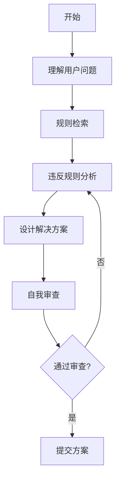

# 🎯 方案设计思维模板

> **目标**: 确保所有方案设计都遵循项目规则和最佳实践
> **生效模式**: 生成方案前强制执行此思维流程
> **最后更新**: 2026-03-24

---

## 📋 使用说明

### 思维流程图



### 强制执行

在生成任何方案前，**必须**按照以下步骤思考和验证：

1. ✅ **理解用户问题**
2. ✅ **规则检索**
3. ✅ **违反规则分析**
4. ✅ **设计解决方案**
5. ✅ **自我审查**

---

## 🤔 第一步：理解用户问题

### 问题识别清单

- [ ] **用户遇到了什么问题？**
  - 描述问题的症状
  - 描述问题的根本原因（如果已知）

- [ ] **涉及哪些文件和代码？**
  - 列出相关的文件路径
  - 列出相关的方法和类

- [ ] **问题发生在哪个层级？**
  - UI 层
  - ViewModel 层
  - Service 层
  - Core 层
  - Plugin 层

- [ ] **用户期望什么结果？**
  - 描述期望的行为
  - 描述期望的输出

### 示例

**用户问题**: "MainWindow.xaml.cs 中使用了 AddLogToUI 方法"

**问题分析**:
- 问题症状：使用了违反规则的日志方法
- 根本原因：没有使用项目的日志系统
- 涉及文件：`src/UI/Views/Windows/MainWindow.xaml.cs`
- 问题层级：UI 层
- 期望结果：使用正确的日志方法记录日志

---

## 🔍 第二步：规则检索

### 规则检索流程

#### 1. 关键词搜索

根据问题类型搜索相关规则：

| 问题类型 | 关键词 | 相关规则 |
|---------|--------|---------|
| 日志输出 | "日志" | rule-003 |
| 属性通知 | "属性"、"通知" | rule-001 |
| 命名 | "命名" | rule-002 |
| 方案设计 | "方案"、"设计" | rule-004, rule-010 |
| 原型设计 | "原型"、"重构" | rule-008 |
| 临时文件 | "临时"、"清理" | rule-011 |
| 参数系统 | "参数" | rule-012 |

#### 2. 读取规则内容

使用 `read_rules` 工具读取规则详情：

```bash
# 示例：读取日志系统使用规范
read_rules ruleNames="logging-system"
```

#### 3. 记录规则要求

将规则的核心要求记录下来：

```
规则: rule-003 日志系统使用规范
优先级: 🟠 High
核心要求:
- ❌ 禁止：Debug.WriteLine, Trace.WriteLine, Console.WriteLine
- ❌ 禁止：直接操作 UI 日志显示（如 AddLogToUI）
- ✅ 正确：ViewModel.LogInfo/LogError/LogSuccess/LogWarning
- ✅ 正确：Service._logger.Log()
```

### 规则检索清单

- [ ] **识别问题类型**
  - 日志输出
  - 属性通知
  - 命名规范
  - 方案设计
  - 其他

- [ ] **搜索相关规则**
  - 搜索关键词
  - 找到规则ID
  - 读取规则内容

- [ ] **记录规则要求**
  - 列出禁止的做法
  - 列出正确的做法
  - 标记优先级

---

## 🚨 第三步：违反规则分析

### 违反规则分析框架

#### 1. 识别违反的规则

```markdown
## 违反的规则

### rule-003: 日志系统使用规范（🟠 High）

**禁止的做法**:
- ❌ 直接操作 UI 日志显示
- ❌ 使用 AddLogToUI 方法
- ❌ 直接修改 LogText 属性

**当前代码违反**:
```csharp
// src/UI/Views/Windows/MainWindow.xaml.cs:1891
AddLogToUI("❌ 没有选中工作流标签页");
```

**原因**: 绕过了项目的日志系统，直接操作 UI
```

#### 2. 分析违反的影响

```markdown
### 违反的影响

1. **违反了 rule-003（日志系统使用规范）**
   - 日志没有通过统一的日志系统输出
   - 其他组件无法正确处理这些日志
   - 日志级别不明确（Error vs Warning）

2. **违反了 rule-008（原型设计期代码纯净原则）**
   - AddLogToUI 方法是旧代码，应该删除
   - 不应该保留兼容层

3. **潜在风险**
   - 日志显示不一致
   - 无法统一管理日志
   - 日志过滤和搜索功能失效
```

#### 3. 确定正确的做法

```markdown
### 正确的做法

根据 rule-003，应该使用 ViewModel 的日志方法：

```csharp
// ✅ 正确：通过 ViewModel 记录日志
_viewModel.LogWarning("没有选中工作流标签页");
```

**日志级别选择**:
- 使用 `LogWarning` 而非 `LogError`
- 原因：这是用户操作不当导致的警告，而非系统错误
```

### 违反规则分析清单

- [ ] **识别所有违反的规则**
  - 列出规则ID和名称
  - 说明违规的具体行为

- [ ] **分析违反的影响**
  - 对代码质量的影响
  - 对系统稳定性的影响
  - 对用户体验的影响

- [ ] **确定正确的做法**
  - 根据规则要求，确定正确的做法
  - 提供具体的代码示例

---

## 💡 第四步：设计解决方案

### 方案设计框架

```markdown
## 💡 解决方案

### 方案设计（遵循所有相关规则）

#### 方案概述
[简要描述方案的目标和主要内容]

#### 涉及的规则
- **rule-003: 日志系统使用规范**（🟠 High）
  - 具体应用：使用 ViewModel 的日志方法
- **rule-008: 原型设计期代码纯净原则**（🔴 Critical）
  - 具体应用：直接删除 AddLogToUI 方法

#### 技术方案

##### 1. [步骤1]
**描述**: [详细描述]
**理由**: [说明理由]
**遵循的规则**: rule-XXX

**代码示例**:
```csharp
// 代码示例
```

##### 2. [步骤2]
**描述**: [详细描述]
**理由**: [说明理由]
**遵循的规则**: rule-XXX

**代码示例**:
```csharp
// 代码示例
```

### 实施步骤
1. [步骤1的描述]
2. [步骤2的描述]
3. [步骤3的描述]

### 验证清单
- [ ] 遵循 rule-001: 属性更改通知统一规范
- [ ] 遵循 rule-002: 命名规范
- [ ] 遵循 rule-003: 日志系统使用规范 ✅
- [ ] 遵循 rule-008: 原型设计期代码纯净原则 ✅
- [ ] 遵循 rule-004: 方案设计要求

### 风险控制
- **风险1**: [描述]
  - 缓解措施：[措施]
- **风险2**: [描述]
  - 缓解措施：[措施]
```

### 方案设计清单

- [ ] **方案概述**
  - 明确方案的目标
  - 简要描述方案内容

- [ ] **涉及的规则**
  - 列出所有相关规则
  - 说明每个规则的具体应用

- [ ] **技术方案**
  - 详细的实施步骤
  - 每个步骤的理由
  - 每个步骤遵循的规则

- [ ] **实施步骤**
  - 清晰的实施步骤
  - 优先级排序

- [ ] **验证清单**
  - 对照规则检查清单
  - 逐项验证

- [ ] **风险控制**
  - 识别潜在风险
  - 提供缓解措施

---

## ✅ 第五步：自我审查

### 自我审查框架

#### 1. 规则遵守审查

```markdown
## ✅ 自我审查

### 规则遵守审查
- [x] 对照了所有相关规则
  - rule-001: ✅ 无相关内容
  - rule-002: ✅ 无相关内容
  - rule-003: ✅ 已遵循
  - rule-008: ✅ 已遵循
  - rule-004: ✅ 已遵循

- [x] 明确标注了遵循的规则
  - 在方案中标注了 rule-003
  - 在方案中标注了 rule-008

- [x] 没有违反任何规则
  - 代码使用 ViewModel.LogWarning
  - 删除了 AddLogToUI 方法
```

#### 2. 方案质量审查

```markdown
### 方案质量审查
- [x] 方案考虑了整体架构
  - 遵循了 MVVM 架构
  - 遵循了分层架构

- [x] 复用了现有基础设施
  - 使用了 ViewModel 的日志方法
  - 使用了现有的日志系统

- [x] 遵循了原型设计期原则
  - 直接删除了旧代码
  - 没有保留兼容层
```

#### 3. 代码质量审查

```markdown
### 代码质量审查
- [x] 命名符合规范
  - 使用了正确的方法名
  - 没有引入新的命名违反

- [x] 日志使用正确
  - 使用了正确的日志方法
  - 使用了正确的日志级别

- [x] 删除了旧代码
  - 删除了 AddLogToUI 方法
  - 没有保留兼容层
```

#### 4. 验证清单审查

```markdown
### 验证清单审查
- [x] 验证清单完整
  - 包含了所有相关规则
  - 每个规则都有检查项

- [x] 所有检查项通过
  - rule-001: ✅
  - rule-002: ✅
  - rule-003: ✅
  - rule-008: ✅
  - rule-004: ✅
```

### 自我审查清单

- [ ] **规则遵守审查**
  - [ ] 对照了所有相关规则
  - [ ] 明确标注了遵循的规则
  - [ ] 没有违反任何规则

- [ ] **方案质量审查**
  - [ ] 方案考虑了整体架构
  - [ ] 复用了现有基础设施
  - [ ] 遵循了原型设计期原则

- [ ] **代码质量审查**
  - [ ] 命名符合规范
  - [ ] 日志使用正确
  - [ ] 删除了旧代码

- [ ] **验证清单审查**
  - [ ] 验证清单完整
  - [ ] 所有检查项通过

---

## 📊 方案输出模板

### 完整方案模板

```markdown
## 🎯 问题分析

### 用户意图
[理解用户的真实需求]

### 涉及的代码
[列出涉及的文件和方法]

### 相关规则检查
- [ ] 检查 rule-001: 属性更改通知统一规范
- [ ] 检查 rule-002: 命名规范
- [ ] 检查 rule-003: 日志系统使用规范 ⚠️ **最高优先级**
- [ ] 检查 rule-008: 原型设计期代码纯净原则
- [ ] 检查 rule-004: 方案设计要求

### 违反的规则
- ❌ rule-003: 日志系统使用规范
  - 具体问题：使用了 AddLogToUI 方法
  - 正确做法：使用 ViewModel.LogWarning

## 💡 解决方案

### 方案设计（遵循所有相关规则）

#### 涉及的规则
- **rule-003: 日志系统使用规范**（🟠 High）
  - 具体应用：使用 ViewModel 的日志方法
- **rule-008: 原型设计期代码纯净原则**（🔴 Critical）
  - 具体应用：直接删除 AddLogToUI 方法

#### 技术方案

##### 1. 删除 AddLogToUI 方法
**文件**: `src/UI/Views/Windows/MainWindow.xaml.cs`  
**位置**: Lines 107-143

**理由**: 遵循 rule-008（原型设计期代码纯净原则），直接删除旧代码，不保留兼容层

##### 2. 修改日志调用
**文件**: `src/UI/Views/Windows/MainWindow.xaml.cs`  
**位置**: Line 1891

**修改前**:
```csharp
// ❌ 错误：违反 rule-003
AddLogToUI("❌ 没有选中工作流标签页");
```

**修改后**:
```csharp
// ✅ 正确：遵循 rule-003
_viewModel.LogWarning("没有选中工作流标签页");
```

**理由**: 遵循 rule-003（日志系统使用规范），使用 ViewModel 的日志方法

**日志级别选择**:
- 使用 `LogWarning` 而非 `LogError`
- 原因：这是用户操作不当导致的警告，而非系统错误

### 实施步骤
1. 删除 `AddLogToUI` 方法（lines 107-143）
2. 修改第 1891 行的日志调用
3. 搜索并修复所有其他 `AddLogToUI` 调用
4. 验证编译通过
5. 测试日志功能正常工作

### 验证清单
- [x] 遵循 rule-003: 日志系统使用规范
  - [x] 删除了 `AddLogToUI` 方法
  - [x] 使用 ViewModel 的日志方法
  - [x] 日志级别使用恰当
  
- [x] 遵循 rule-008: 原型设计期代码纯净原则
  - [x] 直接删除旧代码，不保留兼容层
  - [x] 不使用 `[Obsolete]` 标记

- [x] 遵循 rule-002: 命名规范
  - [x] 不引入新的命名违反

### 风险控制
- **风险1**: 可能还有其他地方使用了 `AddLogToUI`
  - 缓解措施：全局搜索并修复所有调用

- **风险2**: 日志级别使用不当
  - 缓解措施：仔细选择日志级别，遵循规则说明

## ✅ 自我审查

### 规则遵守审查
- [x] 对照了所有相关规则
- [x] 明确标注了遵循的规则
- [x] 没有违反任何规则

### 方案质量审查
- [x] 方案考虑了整体架构
- [x] 复用了现有基础设施
- [x] 遵循了原型设计期原则

### 代码质量审查
- [x] 命名符合规范
- [x] 日志使用正确
- [x] 删除了旧代码

### 验证清单审查
- [x] 验证清单完整
- [x] 所有检查项通过
```

---

## 🔄 变更历史

| 日期 | 版本 | 变更内容 | 作者 |
|------|------|----------|------|
| 2026-03-24 | 1.0 | 初始版本，建立方案设计思维模板 | Team |

---

**最后更新**: 2026-03-24  
**维护者**: SunEyeVision Team  
**版本**: 1.0
