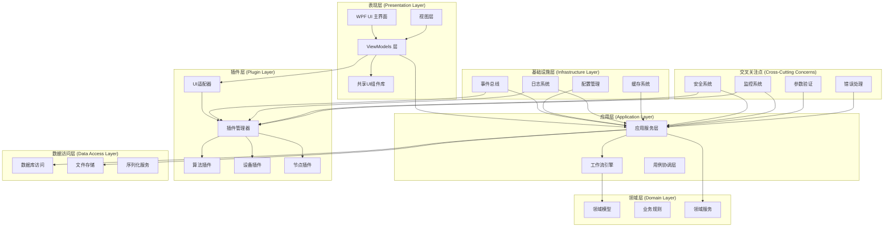
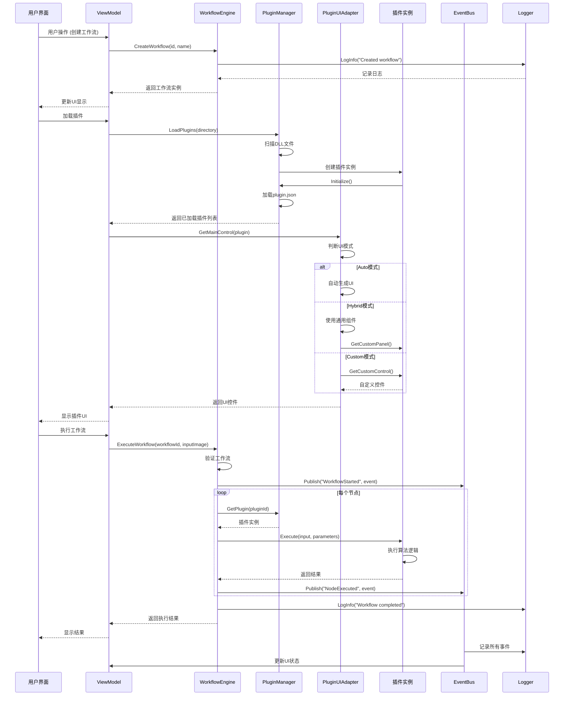
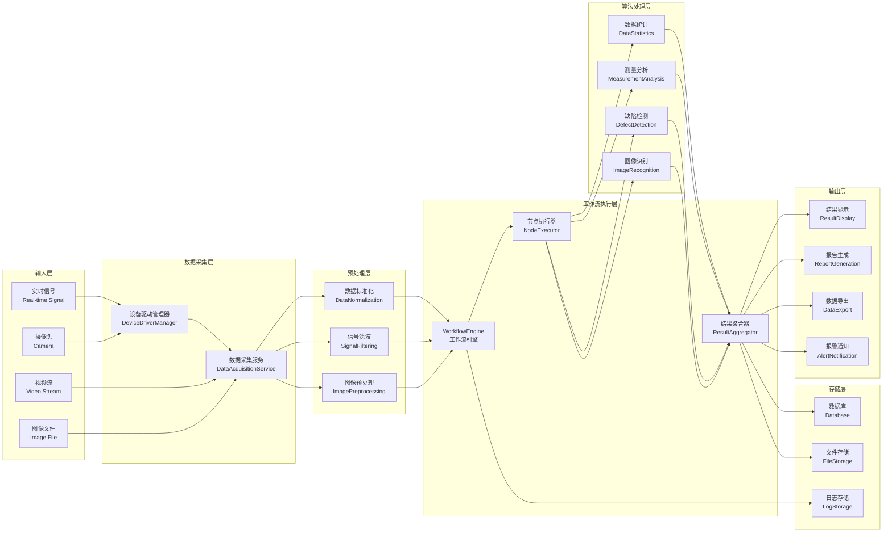
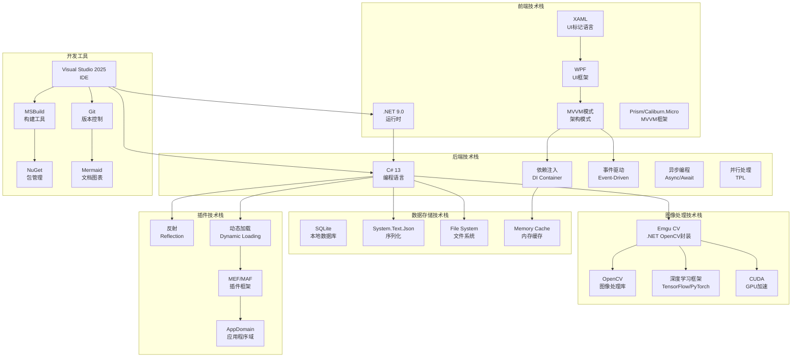
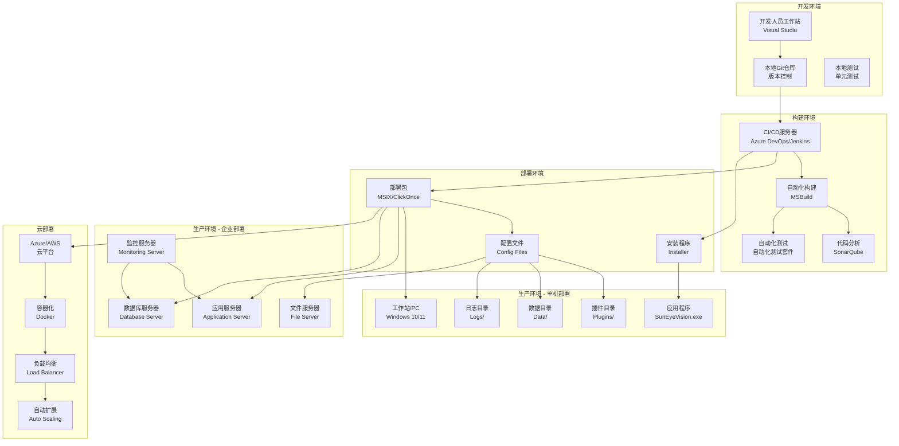
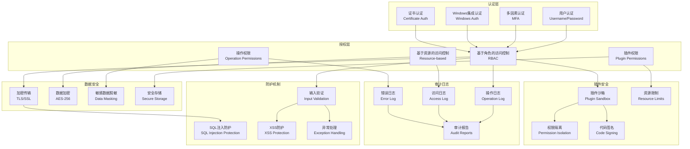

# Mermaid 图表生成指南

## 使用方法

1. 访问: https://mermaid.live/
2. 复制下面的任意图表代码
3. 粘贴到左侧编辑器
4. 点击 "Actions" → "Export PNG" 或 "Export SVG"
5. 下载图片并插入到 Word 文档中

---

## 图表 1: 整体架构图



---

## 图表 2: 分层架构图

```mermaid
graph TB
    subgraph "表现层 - 用户界面"
        UI1[主窗口<br/>MainWindow]
        UI2[工作流画布<br/>WorkflowCanvas]
        UI3[属性面板<br/>PropertyPanel]
        UI4[插件浏览器<br/>PluginBrowser]
        UI5[日志查看器<br/>LogViewer]
        UI6[调试控制台<br/>DebugConsole]
    end

    subgraph "应用层 - 业务逻辑协调"
        App1[工作流执行服务<br/>WorkflowExecutionService]
        App2[插件加载服务<br/>PluginLoadService]
        App3[设备管理服务<br/>DeviceManagementService]
        App4[图像处理服务<br/>ImageProcessingService]
        App5[配置服务<br/>ConfigurationService]
    end

    subgraph "领域层 - 核心业务模型"
        Domain1[工作流模型<br/>Workflow]
        Domain2[节点模型<br/>WorkflowNode]
        Domain3[连接模型<br/>Connection]
        Domain4[算法结果<br/>AlgorithmResult]
        Domain5[设备模型<br/>Device]
    end

    subgraph "插件层 - 可扩展功能"
        Plugin1[算法插件<br/>IAlgorithmPlugin]
        Plugin2[节点插件<br/>INodePlugin]
        Plugin3[设备驱动插件<br/>IDeviceDriver]
        Plugin4[自定义UI插件<br/>IPluginUIProvider]
    end

    subgraph "基础设施层 - 技术服务"
        Infra1[事件总线<br/>EventBus]
        Infra2[日志记录器<br/>Logger]
        Infra3[配置管理器<br/>ConfigManager]
        Infra4[序列化服务<br/>Serializer]
    end

    subgraph "数据访问层 - 数据管理"
        Data1[工作流持久化<br/>WorkflowPersistence]
        Data2[插件元数据<br/>PluginMetadata]
        Data3[用户设置<br/>UserSettings]
        Data4[历史记录<br/>History]
    end

    subgraph "交叉关注点 - 横切关注点"
        Cross1[认证授权<br/>Authentication]
        Cross2[性能监控<br/>PerformanceMonitor]
        Cross3[异常处理<br/>ExceptionHandler]
        Cross4[参数验证<br/>ParameterValidator]
    end

    UI1 --> App1
    UI2 --> App1
    UI3 --> App1
    UI4 --> App2
    UI5 --> App2
    UI6 --> App1

    App1 --> Domain1
    App1 --> Domain2
    App1 --> Plugin1
    App1 --> Plugin2
    App2 --> Plugin1
    App2 --> Plugin3
    App2 --> Plugin4
    App3 --> Domain5
    App3 --> Plugin3
    App4 --> Plugin1
    App4 --> Domain4

    Plugin1 --> Domain4
    Plugin2 --> Domain2
    Plugin3 --> Domain5

    App1 --> Infra1
    App2 --> Infra1
    App3 --> Infra2
    App4 --> Infra2
    App1 --> Infra3
    App2 --> Infra3

    App1 --> Data1
    App2 --> Data2
    App1 --> Data3
    App1 --> Data4

    Cross1 --> App1
    Cross1 --> App2
    Cross2 --> App1
    Cross2 --> App3
    Cross3 --> App1
    Cross3 --> App2
    Cross4 --> App1
    Cross4 --> App4
```



---

## 图表 3: 组件交互图



---

## 图表 4: 数据流图



---

## 图表 5: 插件系统架构图

```mermaid
graph TB
    subgraph "插件接口层"
        I1[IPlugin<br/>基础接口]
        I2[IPluginUIProvider<br/>UI提供者]
        I3[IAlgorithmPlugin<br/>算法插件]
        I4[INodePlugin<br/>节点插件]
        I5[IDeviceDriver<br/>设备驱动]
    end

    subgraph "插件管理器"
        PM1[PluginManager<br/>插件管理器]
        PM2[PluginLoader<br/>插件加载器]
        PM3[PluginLifecycle<br/>生命周期管理]
        PM4[PluginDependency<br/>依赖管理]
    end

    subgraph "UI适配器"
        UA1[PluginUIAdapter<br/>UI适配器]
        UA2[AutoModeGenerator<br/>Auto模式生成器]
        UA3[HybridModeProvider<br/>Hybrid模式提供器]
        UA4[CustomModeProvider<br/>Custom模式提供器]
    end

    subgraph "共享UI组件库"
        SC1[GenericPropertyGrid<br/>属性网格]
        SC2[GenericParameterPanel<br/>参数面板]
        SC3[ImageVisualizationPanel<br/>图像可视化]
        SC4[ProgressPanel<br/>进度面板]
        SC5[StatusIndicator<br/>状态指示器]
    end

    subgraph "插件实例层"
        P1[ImageProcessingPlugin<br/>图像处理插件]
        P2[WorkflowPlugin<br/>工作流插件]
        P3[CustomFiltersPlugin<br/>自定义滤镜插件]
        P4[DeviceDriverPlugin<br/>设备驱动插件]
    end

    subgraph "插件沙箱"
        PS1[AppDomain隔离<br/>AppDomain Isolation]
        PS2[资源限制<br/>Resource Limits]
        PS3[安全检查<br/>Security Check]
        PS4[权限控制<br/>Permission Control]
    end

    subgraph "插件市场"
        PL1[在线插件库<br/>Online Repository]
        PL2[版本管理<br/>Version Management]
        PL3[评分评论<br/>Rating & Reviews]
        PL4[自动更新<br/>Auto Update]
    end

    P1 -.实现.-> I1
    P1 -.实现.-> I3
    P2 -.实现.-> I1
    P2 -.实现.-> I4
    P2 -.实现.-> I2
    P3 -.实现.-> I1
    P3 -.实现.-> I3
    P3 -.实现.-> I2
    P4 -.实现.-> I1
    P4 -.实现.-> I5

    PM1 --> PM2
    PM1 --> PM3
    PM1 --> PM4
    PM2 --> P1
    PM2 --> P2
    PM2 --> P3
    PM2 --> P4

    UA1 --> P1
    UA1 --> P2
    UA1 --> P3
    UA1 --> UA2
    UA1 --> UA3
    UA1 --> UA4

    UA2 --> SC1
    UA2 --> SC2
    UA3 --> SC1
    UA3 --> SC2
    UA3 --> SC3
    UA3 --> SC4
    UA3 --> SC5

    PM1 --> PS1
    PM1 --> PS2
    PM1 --> PS3
    PM1 --> PS4

    PM1 -.连接.-> PL1
    PL1 --> PL2
    PL1 --> PL3
    PL1 --> PL4
```



---

## 图表 6: 技术栈图



---

## 图表 7: 部署架构图



---

## 图表 8: 安全架构图



---

## 💡 快速提示

1. **复制整个代码块** - 从 ```mermaid 到 ```
2. **粘贴到编辑器** - https://mermaid.live/
3. **调整大小** - 使用滚轮缩放查看
4. **导出格式** - PNG 或 SVG 都可以
5. **插入Word** - Word 完全支持这两种格式

---

## 📝 建议的导出设置

- **分辨率**: 1200px 或更高
- **格式**: PNG (Word兼容性更好)
- **背景**: 透明或白色
- **主题**: 默认主题即可
