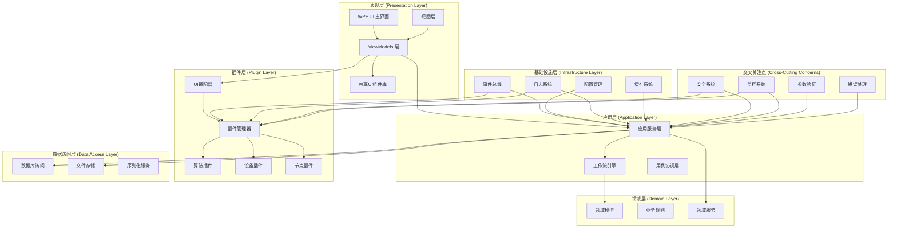
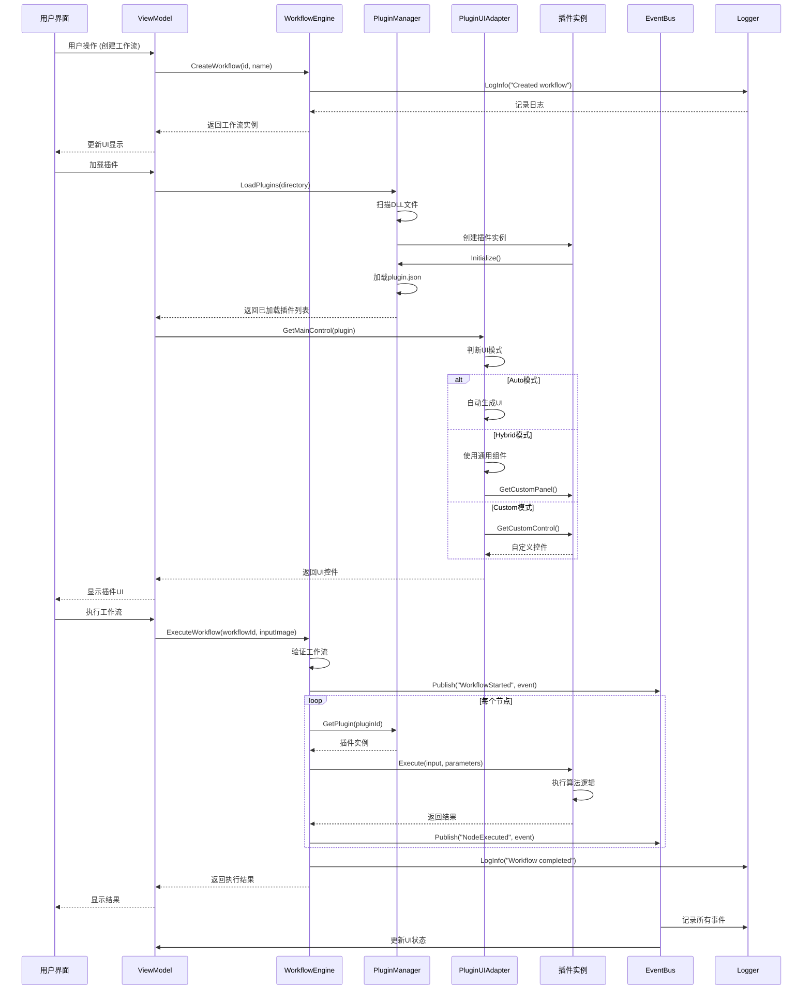
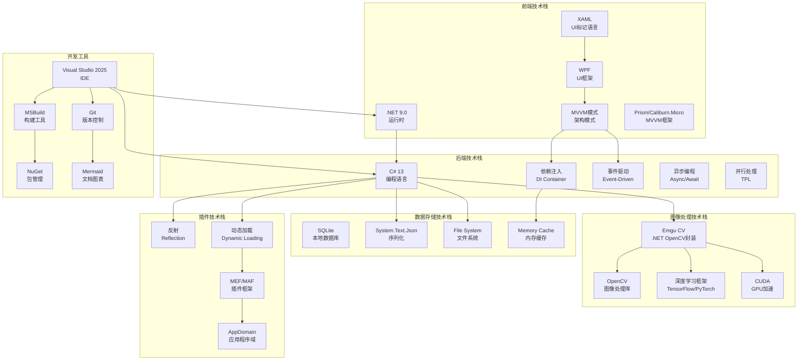
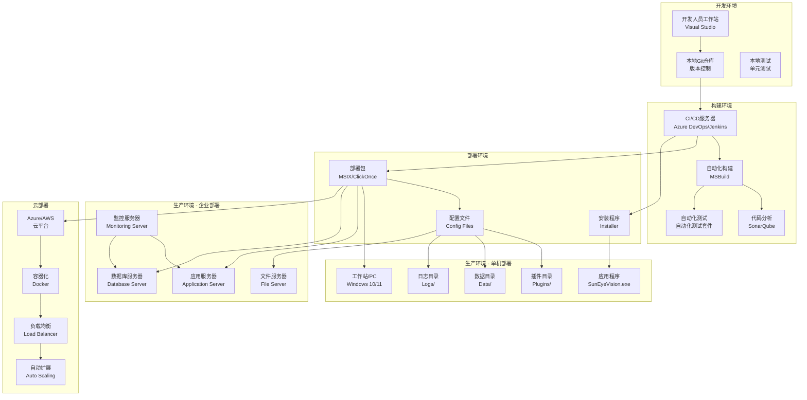
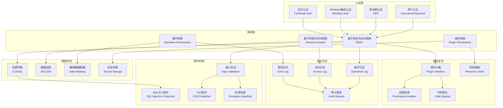

# SunEyeVision 完整软件架构图

## 概述

本文档提供了 SunEyeVision 项目的完整软件架构图，包括当前已实现的组件和未来可能实现的企业级组件。文档采用 Mermaid 图表形式展示架构设计。

---

## 一、整体架构图

---

## 二、分层架构图

```mermaid
graph TB
    subgraph "表现层 - 用户界面"
        UI1[主窗口<br/>MainWindow]
        UI2[工作流画布<br/>WorkflowCanvas]
        UI3[属性面板<br/>PropertyPanel]
        UI4[插件浏览器<br/>PluginBrowser]
        UI5[日志查看器<br/>LogViewer]
        UI6[调试控制台<br/>DebugConsole]
    end

    subgraph "应用层 - 业务逻辑协调"
        App1[工作流执行服务<br/>WorkflowExecutionService]
        App2[插件加载服务<br/>PluginLoadService]
        App3[设备管理服务<br/>DeviceManagementService]
        App4[图像处理服务<br/>ImageProcessingService]
        App5[配置服务<br/>ConfigurationService]
    end

    subgraph "领域层 - 核心业务模型"
        Domain1[工作流模型<br/>Workflow]
        Domain2[节点模型<br/>WorkflowNode]
        Domain3[连接模型<br/>Connection]
        Domain4[算法结果<br/>AlgorithmResult]
        Domain5[设备模型<br/>Device]
    end

    subgraph "插件层 - 可扩展功能"
        Plugin1[算法插件<br/>IAlgorithmPlugin]
        Plugin2[节点插件<br/>INodePlugin]
        Plugin3[设备驱动插件<br/>IDeviceDriver]
        Plugin4[自定义UI插件<br/>IPluginUIProvider]
    end

    subgraph "基础设施层 - 技术服务"
        Infra1[事件总线<br/>EventBus]
        Infra2[日志记录器<br/>Logger]
        Infra3[配置管理器<br/>ConfigManager]
        Infra4[序列化服务<br/>Serializer]
    end

    subgraph "数据访问层 - 数据管理"
        Data1[工作流持久化<br/>WorkflowPersistence]
        Data2[插件元数据<br/>PluginMetadata]
        Data3[用户设置<br/>UserSettings]
        Data4[历史记录<br/>History]
    end

    subgraph "交叉关注点 - 横切关注点"
        Cross1[认证授权<br/>Authentication]
        Cross2[性能监控<br/>PerformanceMonitor]
        Cross3[异常处理<br/>ExceptionHandler]
        Cross4[参数验证<br/>ParameterValidator]
    end

    UI1 --> App1
    UI2 --> App1
    UI3 --> App1
    UI4 --> App2
    UI5 --> App2
    UI6 --> App1

    App1 --> Domain1
    App1 --> Domain2
    App1 --> Plugin1
    App1 --> Plugin2
    App2 --> Plugin1
    App2 --> Plugin3
    App2 --> Plugin4
    App3 --> Domain5
    App3 --> Plugin3
    App4 --> Plugin1
    App4 --> Domain4

    Plugin1 --> Domain4
    Plugin2 --> Domain2
    Plugin3 --> Domain5

    App1 --> Infra1
    App2 --> Infra1
    App3 --> Infra2
    App4 --> Infra2
    App1 --> Infra3
    App2 --> Infra3

    App1 --> Data1
    App2 --> Data2
    App1 --> Data3
    App1 --> Data4

    Cross1 --> App1
    Cross1 --> App2
    Cross2 --> App1
    Cross2 --> App3
    Cross3 --> App1
    Cross3 --> App2
    Cross4 --> App1
    Cross4 --> App4
```

---

## 三、组件交互图

---

## 四、数据流图

```mermaid
graph LR
    subgraph "输入层"
        A[摄像头<br/>Camera]
        B[图像文件<br/>Image File]
        C[视频流<br/>Video Stream]
        D[实时信号<br/>Real-time Signal]
    end

    subgraph "数据采集层"
        E[设备驱动管理器<br/>DeviceDriverManager]
        F[数据采集服务<br/>DataAcquisitionService]
    end

    subgraph "预处理层"
        G[图像预处理<br/>ImagePreprocessing]
        H[信号滤波<br/>SignalFiltering]
        I[数据标准化<br/>DataNormalization]
    end

    subgraph "工作流执行层"
        J[WorkflowEngine<br/>工作流引擎]
        K[节点执行器<br/>NodeExecutor]
        L[结果聚合器<br/>ResultAggregator]
    end

    subgraph "算法处理层"
        M[图像识别<br/>ImageRecognition]
        N[缺陷检测<br/>DefectDetection]
        O[测量分析<br/>MeasurementAnalysis]
        P[数据统计<br/>DataStatistics]
    end

    subgraph "输出层"
        Q[结果显示<br/>ResultDisplay]
        R[报告生成<br/>ReportGeneration]
        S[数据导出<br/>DataExport]
        T[报警通知<br/>AlertNotification]
    end

    subgraph "存储层"
        U[数据库<br/>Database]
        V[文件存储<br/>FileStorage]
        W[日志存储<br/>LogStorage]
    end

    A --> E
    B --> F
    C --> F
    D --> E

    E --> F
    F --> G
    F --> H
    F --> I

    G --> J
    H --> J
    I --> J

    J --> K
    K --> M
    K --> N
    K --> O
    K --> P

    M --> L
    N --> L
    O --> L
    P --> L

    L --> Q
    L --> R
    L --> S
    L --> T

    L --> U
    L --> V
    J --> W
```

---

## 五、插件系统架构图

```mermaid
graph TB
    subgraph "插件接口层"
        I1[IPlugin<br/>基础接口]
        I2[IPluginUIProvider<br/>UI提供者]
        I3[IAlgorithmPlugin<br/>算法插件]
        I4[INodePlugin<br/>节点插件]
        I5[IDeviceDriver<br/>设备驱动]
    end

    subgraph "插件管理器"
        PM1[PluginManager<br/>插件管理器]
        PM2[PluginLoader<br/>插件加载器]
        PM3[PluginLifecycle<br/>生命周期管理]
        PM4[PluginDependency<br/>依赖管理]
    end

    subgraph "UI适配器"
        UA1[PluginUIAdapter<br/>UI适配器]
        UA2[AutoModeGenerator<br/>Auto模式生成器]
        UA3[HybridModeProvider<br/>Hybrid模式提供器]
        UA4[CustomModeProvider<br/>Custom模式提供器]
    end

    subgraph "共享UI组件库"
        SC1[GenericPropertyGrid<br/>属性网格]
        SC2[GenericParameterPanel<br/>参数面板]
        SC3[ImageVisualizationPanel<br/>图像可视化]
        SC4[ProgressPanel<br/>进度面板]
        SC5[StatusIndicator<br/>状态指示器]
    end

    subgraph "插件实例层"
        P1[ImageProcessingPlugin<br/>图像处理插件]
        P2[WorkflowPlugin<br/>工作流插件]
        P3[CustomFiltersPlugin<br/>自定义滤镜插件]
        P4[DeviceDriverPlugin<br/>设备驱动插件]
    end

    subgraph "插件沙箱"
        PS1[AppDomain隔离<br/>AppDomain Isolation]
        PS2[资源限制<br/>Resource Limits]
        PS3[安全检查<br/>Security Check]
        PS4[权限控制<br/>Permission Control]
    end

    subgraph "插件市场"
        PL1[在线插件库<br/>Online Repository]
        PL2[版本管理<br/>Version Management]
        PL3[评分评论<br/>Rating & Reviews]
        PL4[自动更新<br/>Auto Update]
    end

    P1 -.实现.-> I1
    P1 -.实现.-> I3
    P2 -.实现.-> I1
    P2 -.实现.-> I4
    P2 -.实现.-> I2
    P3 -.实现.-> I1
    P3 -.实现.-> I3
    P3 -.实现.-> I2
    P4 -.实现.-> I1
    P4 -.实现.-> I5

    PM1 --> PM2
    PM1 --> PM3
    PM1 --> PM4
    PM2 --> P1
    PM2 --> P2
    PM2 --> P3
    PM2 --> P4

    UA1 --> P1
    UA1 --> P2
    UA1 --> P3
    UA1 --> UA2
    UA1 --> UA3
    UA1 --> UA4

    UA2 --> SC1
    UA2 --> SC2
    UA3 --> SC1
    UA3 --> SC2
    UA3 --> SC3
    UA3 --> SC4
    UA3 --> SC5

    PM1 --> PS1
    PM1 --> PS2
    PM1 --> PS3
    PM1 --> PS4

    PM1 -.连接.-> PL1
    PL1 --> PL2
    PL1 --> PL3
    PL1 --> PL4
```

---

## 六、技术栈图

---

## 七、部署架构图

---

## 八、安全架构图

---

## 九、架构层次说明

### 9.1 表现层 (Presentation Layer)
**职责**: 提供用户界面，接收用户输入，展示系统状态
**主要组件**:
- WPF 主窗口和工作流画布
- MVVM 架构的 Views 和 ViewModels
- 共享 UI 组件库
- 插件浏览器和调试控制台

### 9.2 应用层 (Application Layer)
**职责**: 协调业务逻辑，用例编排，服务管理
**主要组件**:
- WorkflowEngine 工作流引擎
- 应用服务层 (各种业务服务)
- 用例协调层

### 9.3 领域层 (Domain Layer)
**职责**: 核心业务模型和业务规则
**主要组件**:
- 工作流模型 (Workflow, WorkflowNode, Connection)
- 算法结果模型
- 设备模型
- 业务规则验证

### 9.4 插件层 (Plugin Layer)
**职责**: 提供可扩展功能，支持第三方插件
**主要组件**:
- PluginManager 插件管理器
- PluginUIAdapter UI 适配器
- 算法插件、节点插件、设备插件

### 9.5 基础设施层 (Infrastructure Layer)
**职责**: 提供技术服务和基础设施支持
**主要组件**:
- EventBus 事件总线
- Logger 日志系统
- ConfigManager 配置管理
- Serializer 序列化服务

### 9.6 数据访问层 (Data Access Layer)
**职责**: 数据持久化和数据管理
**主要组件**:
- 工作流持久化
- 插件元数据管理
- 用户设置存储
- 历史记录管理

### 9.7 交叉关注点 (Cross-Cutting Concerns)
**职责**: 横切关注点，安全、监控、验证等
**主要组件**:
- 安全系统 (认证、授权)
- 监控系统 (性能监控)
- 参数验证
- 错误处理

---

## 十、设计模式

### 10.1 已实现的设计模式
1. **插件模式 (Plugin Pattern)** - 用于扩展系统功能
2. **适配器模式 (Adapter Pattern)** - PluginUIAdapter 适配不同插件UI
3. **MVVM 模式** - UI 架构
4. **工厂模式 (Factory Pattern)** - WorkflowNodeFactory
5. **单例模式 (Singleton Pattern)** - PluginManager, PanelManager
6. **观察者模式 (Observer Pattern)** - EventBus 事件系统

### 10.2 建议实现的模式
1. **策略模式 (Strategy Pattern)** - 用于不同算法实现
2. **命令模式 (Command Pattern)** - 用于工作流节点执行
3. **建造者模式 (Builder Pattern)** - 用于复杂对象构建
4. **装饰器模式 (Decorator Pattern)** - 用于功能增强
5. **责任链模式 (Chain of Responsibility)** - 用于请求处理链

---

## 十一、技术选型说明

### 11.1 已选技术栈
- **.NET 9.0** - 最新的 .NET 平台，提供更好的性能和特性
- **WPF** - 成熟的桌面应用 UI 框架
- **OpenCV/Emgu CV** - 强大的图像处理库
- **System.Text.Json** - 高性能的 JSON 序列化
- **SQLite** - 轻量级本地数据库

### 11.2 建议技术栈
- **Prism** - MVVM 框架，提供模块化功能
- **MahApps.Metro** - WPF UI 库，提供现代化的 UI 组件
- **ReactiveUI** - 响应式编程框架
- **Serilog** - 结构化日志记录
- **Polly** - 弹性和瞬态故障处理库

---

## 十二、扩展性设计

### 12.1 插件扩展点
1. **算法插件** - 扩展图像处理算法
2. **节点插件** - 扩展工作流节点类型
3. **设备驱动插件** - 扩展硬件设备支持
4. **UI 插件** - 扩展用户界面组件

### 12.2 系统扩展点
1. **数据源扩展** - 支持更多数据输入源
2. **输出格式扩展** - 支持更多结果输出格式
3. **存储后端扩展** - 支持更多数据库
4. **通信协议扩展** - 支持更多设备通信协议

---

## 十三、性能考虑

### 13.1 性能优化策略
1. **异步处理** - 使用 async/await 避免阻塞
2. **并行计算** - 使用 TPL 并行执行多个任务
3. **缓存机制** - 缓存频繁访问的数据
4. **懒加载** - 延迟加载非关键资源
5. **GPU 加速** - 使用 CUDA 加速图像处理

### 13.2 资源管理
1. **内存管理** - 及时释放图像等大对象
2. **线程池** - 合理使用线程池
3. **连接池** - 复用数据库和网络连接
4. **资源限制** - 限制插件资源使用

---

## 十四、可维护性设计

### 14.1 代码组织
1. **分层架构** - 清晰的层次划分
2. **模块化设计** - 功能模块独立
3. **命名规范** - 统一的命名约定
4. **代码注释** - 完善的文档注释

### 14.2 测试策略
1. **单元测试** - 测试各个组件
2. **集成测试** - 测试组件集成
3. **端到端测试** - 测试完整流程
4. **插件测试** - 测试插件加载和执行

---

## 十五、未来扩展方向

### 15.1 短期扩展
1. **完善调试系统** - 添加断点和变量监视
2. **增强插件管理** - 添加热加载和依赖检查
3. **优化 UI 组件** - 添加更多共享控件
4. **完善文档** - API 文档和开发指南

### 15.2 中期扩展
1. **插件市场** - 在线插件库和自动更新
2. **云端协作** - 支持云端存储和协作
3. **AI 集成** - 集成深度学习算法
4. **移动端支持** - 开发移动端应用

### 15.3 长期扩展
1. **分布式架构** - 支持分布式部署
2. **微服务架构** - 拆分为多个微服务
3. **大数据处理** - 支持大数据处理和分析
4. **行业解决方案** - 针对特定行业的解决方案

---

## 总结

本文档提供了 SunEyeVision 项目的完整软件架构图，包括:

✅ **8 个 Mermaid 图表** - 全面展示系统架构
✅ **7 层架构** - 清晰的分层设计
✅ **6 个设计模式** - 已实现和推荐的模式
✅ **扩展性设计** - 插件系统和扩展点
✅ **性能考虑** - 优化策略和资源管理
✅ **可维护性设计** - 代码组织和测试策略
✅ **未来扩展** - 短期、中期和长期扩展方向

这份架构文档为 SunEyeVision 项目的持续发展和企业级应用提供了完整的蓝图。

---

**文档版本**: 1.0.0
**创建日期**: 2026-01-28
**维护者**: SunEyeVision Team
