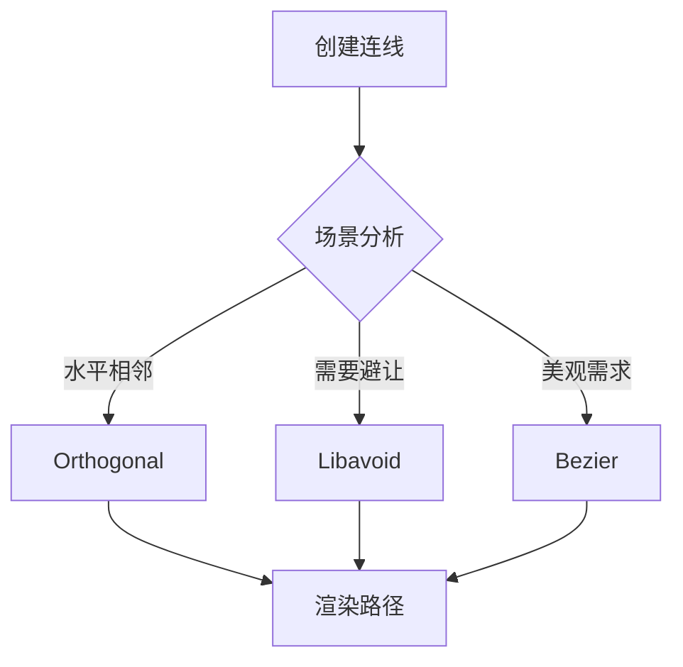

# SunEyeVision 务实开发计划 2026

> **核心理念**：智能自动化 > 复杂配置  
> **开发周期**：6周（2026年2月-3月）  
> **目标**：打造高性能、易用、可维护的视觉软件

---

## 📋 目录

- [核心理念](#核心理念)
- [现状分析](#现状分析)
- [开发目标](#开发目标)
- [开发计划](#开发计划)
- [技术方案](#技术方案)
- [风险管理](#风险管理)
- [成功指标](#成功指标)

---

## 核心理念

### ❌ 抛弃：复杂策略配置系统

**原因**：
- 标准视觉软件（LabVIEW、Halcon、OpenCV）没有策略配置UI
- 用户关注"做什么"（连线和逻辑），而非"怎么做"（路由和执行策略）
- 增加学习成本，降低用户体验

**删除的功能**：
- ❌ 策略配置界面
- ❌ 用户手动选择路径算法
- ❌ 用户手动配置执行策略（并行/串行/条件）
- ❌ 策略模板系统
- ❌ 策略导入导出

### ✅ 采用：智能自动化系统

**原则**：
- 系统自动选择最优策略
- 用户只需关注业务逻辑
- 隐式推导 > 显式配置

**实现方案**：

#### 1. 路径自动选择（后台智能）

```csharp
public class SmartPathSelector
{
    public PathCalculatorType SelectBestStrategy(
        Point source, Point target,
        PortDirection sourceDir, PortDirection targetDir,
        Rect[] allNodes)
    {
        // 简单场景 → 直连
        if (IsSimpleScenario(source, target, sourceDir, targetDir))
            return PathCalculatorType.Orthogonal;
        
        // 复杂避让 → Libavoid
        if (NeedsAvoidance(source, target, allNodes))
            return PathCalculatorType.Libavoid;
        
        // 美观需求 → Bezier
        if (IsComplexScenario(source, target))
            return PathCalculatorType.Bezier;
        
        // 默认 → 正交路径
        return PathCalculatorType.Orthogonal;
    }
}
```

**用户无感知**：系统根据场景自动选择最优路径算法

#### 2. 执行顺序自动推导（基于拓扑）

```csharp
public class ExecutionOrderOptimizer
{
    public List<ExecutionGroup> OptimizeExecution(WorkflowNode root)
    {
        // 基于拓扑排序自动推导
        var sorted = TopologicalSort(root);
        var groups = GroupByParallelism(sorted);
        
        // 并行组 → 自动并发执行
        // 串行组 → 顺序执行
        return groups;
    }
}
```

**用户无感知**：通过连线语义自动推导执行顺序

---

## 现状分析

### ✅ 已完成功能

| 功能 | 状态 | 文件 |
|------|------|------|
| 基本拖拽 | ✅ 完成 | WorkflowCanvasControl.xaml.cs |
| 连线创建 | ✅ 完成 | WorkflowConnectionManager.cs |
| 端口高亮 | ✅ 完成 | WorkflowPortHighlighter.cs |
| 批量更新 | ✅ 完成 | ConnectionBatchUpdateManager.cs |
| 路径缓存 | ✅ 完成 | ConnectionPathCache.cs |
| AIStudio集成 | ⚠️ 部分完成 | NativeDiagramControl.xaml.cs |

### ⚠️ 待解决问题

| 问题 | 影响 | 优先级 |
|------|------|--------|
| 无缩放平移 | 用户体验差 | 高 |
| 无撤销重做 | 易误操作 | 高 |
| 连接线渲染问题 | 功能缺陷 | 高 |
| 无对齐吸附 | 布局困难 | 中 |
| 性能瓶颈（~100节点） | 限制扩展性 | 中 |
| 大文件维护困难 | 开发效率低 | 低 |

### 📊 当前性能基准

- **渲染节点数**：~100个（开始卡顿）
- **连线条数**：~200条（更新延迟）
- **拖拽响应**：>50ms
- **缩放平移**：不支持

---

## 开发目标

### 阶段一：核心性能优化（1-2周）

**目标**：提升渲染性能，支持更大工作流

| 任务 | 工作量 | 成果 |
|------|--------|------|
| 虚拟化渲染 | 3天 | 支持500+节点流畅渲染 |
| 批量更新优化 | 2天 | 连线更新延迟<20ms |
| 智能路径选择 | 2天 | 自动选择最优路径算法 |
| 性能基准测试 | 1天 | 建立性能监控体系 |

### 阶段二：用户体验增强（3-4周）

**目标**：提升易用性，减少误操作

| 任务 | 工作量 | 成果 |
|------|--------|------|
| 缩放平移 | 3天 | 支持画布缩放和平移 |
| 撤销重做 | 4天 | 完整的操作历史管理 |
| 对齐吸附 | 3天 | 智能节点对齐 |
| 快捷键支持 | 2天 | 常用操作快捷键 |

### 阶段三：架构重构（5-6周）

**目标**：提升代码质量和可维护性

| 任务 | 工作量 | 成果 |
|------|--------|------|
| 拆分大文件 | 3天 | 单文件<500行 |
| 单元测试 | 4天 | 核心模块测试覆盖>70% |
| 持续集成 | 2天 | 自动化构建和测试 |
| 文档完善 | 1天 | API文档和架构说明 |

---

## 开发计划

### Week 1-2: 核心性能优化

#### Day 1-3: 虚拟化渲染

```csharp
// WorkflowCanvasControl.xaml.cs
public class VirtualizedCanvas : Canvas
{
    private HashSet<int> _visibleNodes = new HashSet<int>();
    
    protected override void OnRenderSizeChanged(SizeChangedInfo sizeInfo)
    {
        base.OnRenderSizeChanged(sizeInfo);
        UpdateVisibleNodes();
    }
    
    private void UpdateVisibleNodes()
    {
        // 只渲染可见区域内的节点
        _visibleNodes = GetNodesInViewPort();
        InvalidateVisual();
    }
}
```

**关键点**：
- 只渲染可见区域的节点
- 使用 `VirtualizingStackPanel` 概念
- 延迟加载非可见节点

#### Day 4-5: 批量更新优化

```csharp
// ConnectionBatchUpdateManager.cs
public class ConnectionBatchUpdateManager
{
    private ConcurrentQueue<ConnectionUpdate> _updateQueue = 
        new ConcurrentQueue<ConnectionUpdate>();
    
    public async Task ProcessBatchAsync(CancellationToken token)
    {
        var batch = new List<ConnectionUpdate>();
        
        while (!token.IsCancellationRequested)
        {
            if (_updateQueue.TryDequeue(out var update))
                batch.Add(update);
            
            if (batch.Count >= 50 || ShouldFlush(batch))
            {
                await ApplyBatchAsync(batch);
                batch.Clear();
            }
        }
    }
}
```

**优化点**：
- 使用 `ConcurrentQueue` 线程安全
- 批量应用更新（50条/批）
- 异步处理避免UI阻塞

#### Day 6-7: 智能路径选择

```csharp
// PathCalculators/SmartPathSelector.cs
public class SmartPathSelector
{
    public PathCalculatorType SelectBestStrategy(
        WorkflowConnection connection)
    {
        var source = connection.SourceNode;
        var target = connection.TargetNode;
        
        // 规则1: 水平相邻且同向端口 → Orthogonal
        if (IsHorizontalAdjacent(source, target) &&
            IsSameDirection(connection))
            return PathCalculatorType.Orthogonal;
        
        // 规则2: 需要避让 → Libavoid
        if (NeedsAvoidance(connection))
            return PathCalculatorType.Libavoid;
        
        // 规则3: 长距离且复杂场景 → Bezier
        if (IsLongDistance(source, target) &&
            IsComplexLayout(connection))
            return PathCalculatorType.Bezier;
        
        // 默认: Orthogonal
        return PathCalculatorType.Orthogonal;
    }
    
    private bool IsHorizontalAdjacent(NodeViewModel s, NodeViewModel t)
    {
        return Math.Abs(s.X - t.X) < 200 &&
               Math.Abs(s.Y - t.Y) < 100;
    }
    
    private bool IsSameDirection(WorkflowConnection conn)
    {
        return conn.SourcePort.Direction == 
               conn.TargetPort.Direction;
    }
    
    private bool NeedsAvoidance(WorkflowConnection conn)
    {
        // 检查路径上是否有其他节点
        var allNodes = GetNodesInBounds(
            conn.SourceNode.Bounds,
            conn.TargetNode.Bounds);
        return allNodes.Count > 0;
    }
}
```

**智能规则**：
- 简单场景 → Orthogonal（最快）
- 复杂避让 → Libavoid（最智能）
- 美观需求 → Bezier（最漂亮）

### Week 3-4: 用户体验增强

#### Day 1-3: 缩放平移

```csharp
// Controls/ZoomPanCanvas.cs
public class ZoomPanCanvas : Canvas
{
    private double _scale = 1.0;
    private Point _offset = new Point(0, 0);
    
    public void Zoom(double delta, Point center)
    {
        var newScale = Math.Max(0.1, Math.Min(3.0, _scale * delta));
        _scale = newScale;
        ApplyTransform();
    }
    
    public void Pan(Vector delta)
    {
        _offset += delta;
        ApplyTransform();
    }
    
    private void ApplyTransform()
    {
        var transform = new ScaleTransform(_scale, _scale);
        var translate = new TranslateTransform(_offset.X, _offset.Y);
        
        RenderTransform = new TransformGroup
        {
            Children = { translate, transform }
        };
    }
}
```

**交互**：
- 鼠标滚轮缩放
- 中键或空格+拖动平移
- 支持双击重置视图

#### Day 4-7: 撤销重做

```csharp
// Services/UndoRedoManager.cs
public class UndoRedoManager
{
    private Stack<IUndoableAction> _undoStack = new Stack<IUndoableAction>();
    private Stack<IUndoableAction> _redoStack = new Stack<IUndoableAction>();
    
    public void Execute(IUndoableAction action)
    {
        action.Execute();
        _undoStack.Push(action);
        _redoStack.Clear();
    }
    
    public void Undo()
    {
        if (_undoStack.Count == 0) return;
        
        var action = _undoStack.Pop();
        action.Undo();
        _redoStack.Push(action);
    }
    
    public void Redo()
    {
        if (_redoStack.Count == 0) return;
        
        var action = _redoStack.Pop();
        action.Execute();
        _undoStack.Push(action);
    }
}

// 典型操作
public class MoveNodeAction : IUndoableAction
{
    private NodeViewModel _node;
    private Point _oldPosition;
    private Point _newPosition;
    
    public void Execute()
    {
        _node.Position = _newPosition;
    }
    
    public void Undo()
    {
        _node.Position = _oldPosition;
    }
}
```

**支持操作**：
- 移动节点
- 创建/删除连线
- 添加/删除节点
- 修改属性

#### Day 8-10: 对齐吸附

```csharp
// Controls/Helpers/AlignmentHelper.cs
public class AlignmentHelper
{
    private const double SnapDistance = 15.0;
    
    public Point SnapToGrid(Point position, double gridSize = 20.0)
    {
        return new Point(
            Math.Round(position.X / gridSize) * gridSize,
            Math.Round(position.Y / gridSize) * gridSize
        );
    }
    
    public Point SnapToNodes(Point position, NodeViewModel[] nodes)
    {
        foreach (var node in nodes)
        {
            // 吸附到水平中线
            if (Math.Abs(position.Y - node.CenterY) < SnapDistance)
                return new Point(position.X, node.CenterY);
            
            // 吸附到垂直中线
            if (Math.Abs(position.X - node.CenterX) < SnapDistance)
                return new Point(node.CenterX, position.Y);
        }
        
        return position;
    }
}
```

**吸附功能**：
- 网格吸附（默认20px）
- 节点中点吸附
- 端口吸附

### Week 5-6: 架构重构

#### Day 1-3: 拆分大文件

**目标文件**：
- `WorkflowCanvasControl.xaml.cs` (当前~800行)
  - 拆分为：
    - `CanvasInteractionHandler.cs`
    - `CanvasRenderer.cs`
    - `CanvasStateManager.cs`

**原则**：
- 单文件<500行
- 单一职责原则
- 保持接口稳定

#### Day 4-7: 单元测试

```csharp
// Tests/PathCalculatorTests.cs
[TestClass]
public class PathCalculatorTests
{
    [TestMethod]
    public void SimpleScenario_ShouldUseOrthogonal()
    {
        var selector = new SmartPathSelector();
        var connection = CreateSimpleConnection();
        
        var result = selector.SelectBestStrategy(connection);
        
        Assert.AreEqual(PathCalculatorType.Orthogonal, result);
    }
    
    [TestMethod]
    public void ComplexScenario_ShouldUseLibavoid()
    {
        var selector = new SmartPathSelector();
        var connection = CreateComplexConnection();
        
        var result = selector.SelectBestStrategy(connection);
        
        Assert.AreEqual(PathCalculatorType.Libavoid, result);
    }
}
```

**测试覆盖**：
- 路径选择逻辑
- 拓扑排序算法
- 撤销重做系统
- 对齐计算

#### Day 8-10: 持续集成和文档

**CI/CD配置**：
```yaml
# .github/workflows/build.yml
name: Build and Test

on: [push, pull_request]

jobs:
  build:
    runs-on: windows-latest
    steps:
      - uses: actions/checkout@v2
      - name: Build
        run: dotnet build SunEyeVision.sln
      - name: Test
        run: dotnet test SunEyeVision.Test
```

**文档完善**：
- API文档（XML注释）
- 架构说明
- 用户指南

---

## 技术方案

### 智能路径选择算法



### 执行顺序自动推导


---

## 风险管理

| 风险 | 概率 | 影响 | 应对措施 |
|------|------|------|---------|
| 性能优化不达预期 | 中 | 高 | 提前基准测试，分阶段优化 |
| 虚拟化渲染复杂度高 | 高 | 中 | 先小范围试点，再全面推广 |
| 单元测试覆盖不足 | 中 | 中 | 建立测试规范，持续改进 |
| 用户习惯改变 | 低 | 低 | 提供迁移指南，保持向后兼容 |

---

## 成功指标

### 性能指标

| 指标 | 当前 | 目标 | 测量方法 |
|------|------|------|---------|
| 渲染节点数 | ~100 | ~500 | 性能测试脚本 |
| 连线更新延迟 | ~50ms | <20ms | 自动化测试 |
| 拖拽响应时间 | ~50ms | <30ms | 性能监控 |

### 用户体验指标

| 指标 | 目标 | 测量方法 |
|------|------|---------|
| 学习曲线时间 | <30分钟 | 用户测试 |
| 误操作恢复率 | 100% | 功能验证 |
| 布局效率提升 | >50% | A/B测试 |

### 代码质量指标

| 指标 | 目标 | 测量方法 |
|------|------|---------|
| 单元测试覆盖率 | >70% | 测试报告 |
| 代码重复率 | <5% | 代码审查 |
| 平均文件行数 | <500 | 统计脚本 |

---

## 后续规划

### Phase 2（可选）

如果Phase 1成功，可以考虑：

1. **插件系统**：支持第三方算法扩展
2. **主题自定义**：支持用户自定义UI主题
3. **云端同步**：支持工作流云端存储
4. **协作功能**：支持多人实时编辑

### 长期愿景

- 成为易用、高性能的视觉软件开发平台
- 建立活跃的插件生态
- 支持多语言国际化

---

## 附录

### A. 废弃文档

以下文档基于复杂策略配置理念，已废弃：

- ~~执行策略开发计划.md~~（1012行）
- ~~策略配置系统设计.md~~（未创建）
- ~~策略模板系统.md~~（未创建）

### B. 参考资源

- [AIStudio.Wpf.DiagramDesigner](https://github.com/...) - 原生Diagram库
- [Libavoid](https://www.adaptagrams.org/) - 路由算法库
- [MSAGL](https://github.com/microsoft/automatic-graph-layout) - 图形布局库

### C. 联系方式

- 项目负责人：[待填写]
- 技术负责人：[待填写]
- 问题反馈：[GitHub Issues]

---

**文档版本**：1.0  
**最后更新**：2026-02-04  
**状态**：待审核
