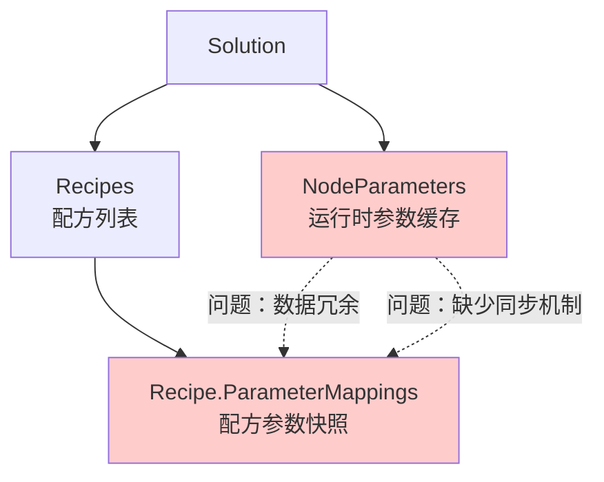
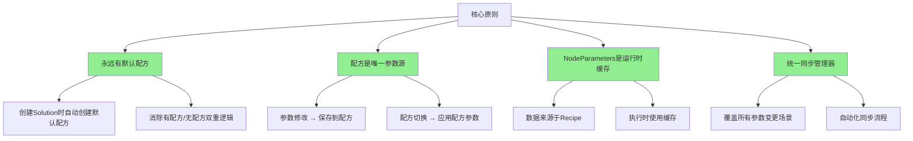
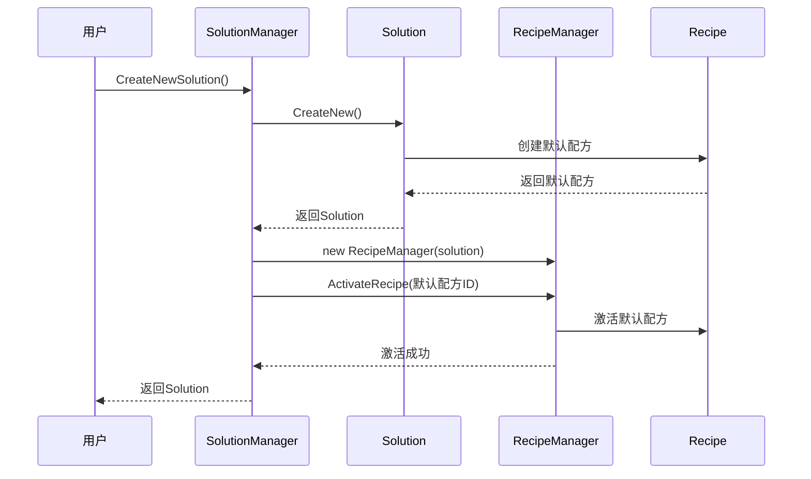
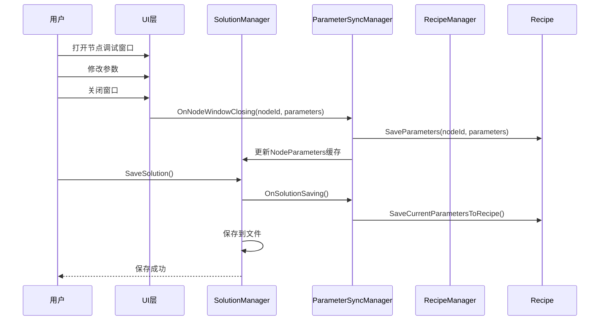
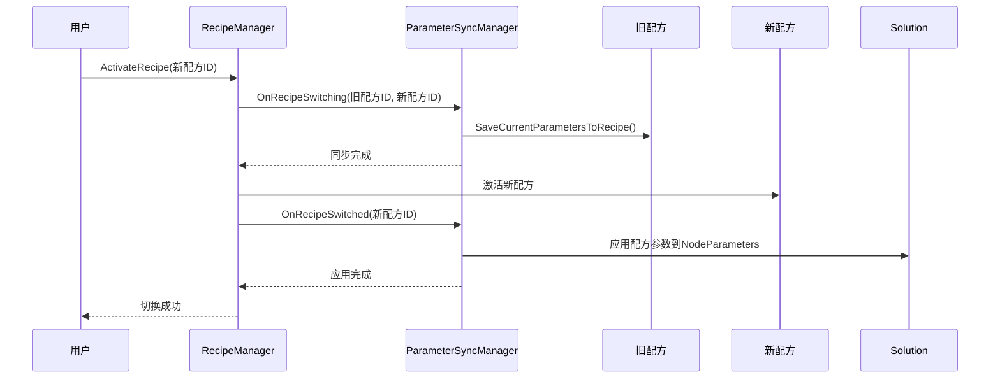
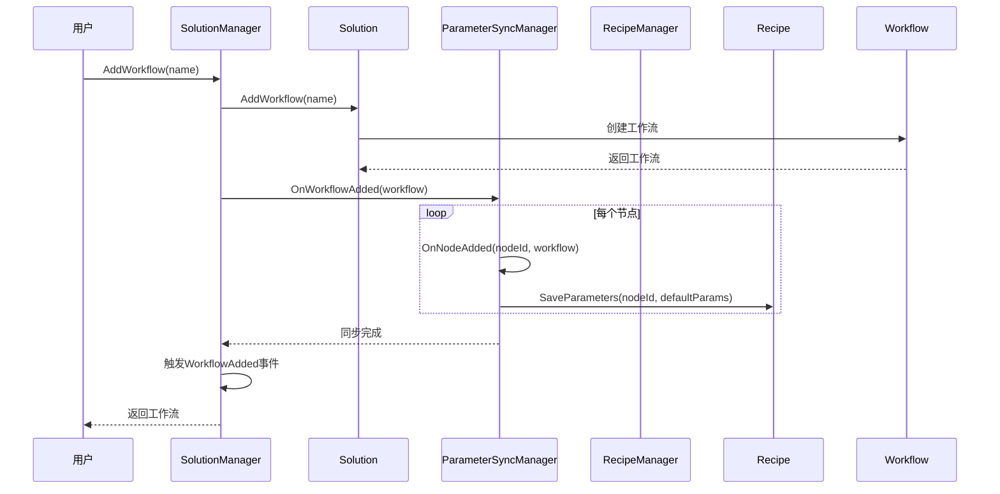
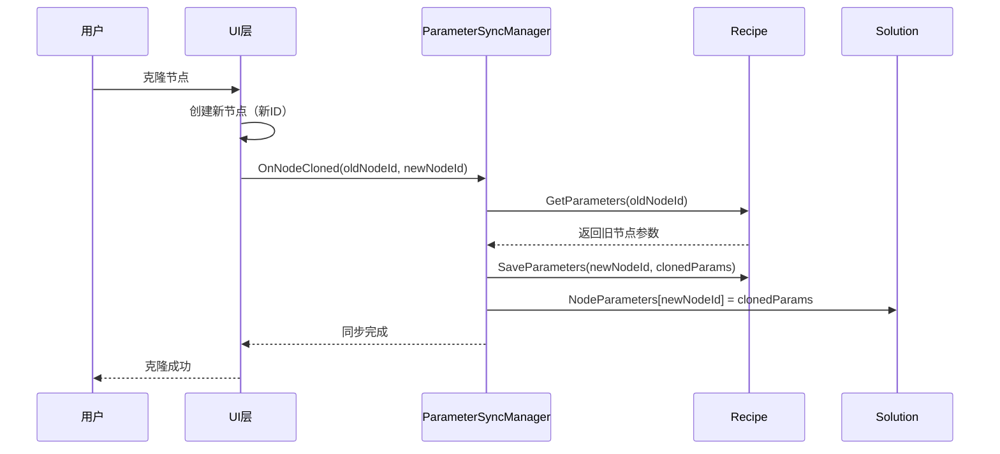

# 解决方案参数同步与保存机制优化方案

## 📋 文档元数据

- **文档ID**: doc-20260319-001
- **创建日期**: 2026-03-19
- **作者**: 开发团队
- **版本**: 1.0
- **状态**: 设计阶段

---

## 一、背景与问题分析

### 1.1 核心数据模型问题

当前解决方案系统存在数据模型设计不合理的问题，主要体现在：



**核心问题**：
1. **职责不清**：Solution同时管理`NodeParameters`和`Recipes`，职责混乱
2. **数据冗余**：`NodeParameters`和`Recipe.ParameterMappings`存储相同数据
3. **缺少同步**：修改节点参数时，需要同时更新两处，缺少统一同步机制

### 1.2 配方管理问题

**问题代码示例**：

```csharp
// RecipeManager.cs 第186-217行
public bool ActivateRecipe(string recipeId)
{
    // ❌ 问题：激活配方前，没有保存当前参数到旧配方
    if (ActiveRecipe != null)
    {
        DeactivateRecipe(); // 只触发事件，不保存参数
    }
    
    ActiveRecipe = recipe;
    ApplyRecipeParameters(recipe); // 应用配方参数到节点
    
    return true;
}
```

**问题列表**：
- 切换配方时，**不保存当前参数到旧配方**
- 创建配方时，不自动从当前`NodeParameters`初始化
- 缺少"保存到配方"的明确机制

### 1.3 参数同步问题汇总表

| 用户操作 | 期望行为 | 当前实现 | 问题 |
|---------|---------|---------|------|
| 修改节点参数 | 保存到当前配方 | 仅更新`NodeParameters` | ❌ 配方未更新 |
| 切换配方 | 保存旧配方 → 应用新配方 | 仅应用新配方 | ❌ 旧配方丢失 |
| 添加节点 | 初始化节点参数 | 无操作 | ❌ 节点无参数 |
| 删除节点 | 移除节点参数 | 无操作 | ❌ 参数残留 |
| 克隆节点 | 复制节点参数 | 无操作 | ❌ 参数未复制 |
| 保存解决方案 | 同步参数到配方 | 仅保存文件 | ❌ 配方未更新 |
| 加载解决方案 | 激活默认配方 | 无操作 | ❌ 未激活配方 |

### 1.4 工作流操作对配方的影响

**问题代码示例**：

```csharp
// SolutionManager.cs 第1105-1139行
public Workflow? AddWorkflow(string name, string description = "")
{
    var workflow = CurrentSolution.AddWorkflow(name);
    WorkflowAdded?.Invoke(this, workflow);
    // ❌ 问题：添加工作流后，没有同步新节点参数
    return workflow;
}

public bool RemoveWorkflow(string workflowId)
{
    bool removed = CurrentSolution.RemoveWorkflow(workflowId);
    if (removed)
    {
        WorkflowRemoved?.Invoke(this, workflow);
        // ❌ 问题：删除工作流后，没有移除节点参数
    }
    return removed;
}
```

---

## 二、优化方案设计

### 2.1 设计原则



### 2.2 数据模型重构

#### 2.2.1 Solution.cs 修改

```csharp
public class Solution : ObservableObject
{
    /// <summary>
    /// 节点参数映射（运行时缓存）
    /// </summary>
    /// <remarks>
    /// ⚠️ 注意：此属性为运行时缓存，数据来源于 CurrentRecipe
    /// - 加载时：从当前激活的配方填充
    /// - 保存时：同步到当前激活的配方
    /// - 执行时：使用此缓存提高性能
    /// </remarks>
    [JsonIgnore(Condition = JsonIgnoreCondition.WhenWritingNull)]
    public Dictionary<string, ToolParameters> NodeParameters { get; set; } = new();

    /// <summary>
    /// 配方列表（持久化存储）
    /// </summary>
    [JsonIgnore(Condition = JsonIgnoreCondition.WhenWritingNull)]
    public List<Recipe> Recipes { get; set; } = new();

    /// <summary>
    /// 默认配方ID
    /// </summary>
    public string? DefaultRecipeId { get; set; }

    /// <summary>
    /// 当前激活的配方ID
    /// </summary>
    [JsonIgnore]
    public string? CurrentRecipeId { get; set; }

    /// <summary>
    /// 创建新解决方案（自动创建默认配方）
    /// </summary>
    public static Solution CreateNew()
    {
        var solution = new Solution
        {
            Id = Guid.NewGuid().ToString(),
            Version = "1.0",
            Workflows = new List<Workflow>(),
            NodeParameters = new Dictionary<string, ToolParameters>(),
            GlobalVariables = new List<GlobalVariable>(),
            Recipes = new List<Recipe>(),
            Devices = new List<Device>(),
            Communications = new List<Communication>(),
            DatabaseConfiguration = new DatabaseConfiguration(),
            ExecutionStrategy = new ExecutionStrategy(),
            VersionHistory = new List<SolutionVersion>()
        };

        // ✅ 创建默认配方
        var defaultRecipe = new Recipe
        {
            Name = "默认配方",
            Description = "默认参数配置",
            IsDefault = true,
            CreatedTime = DateTime.Now,
            LastModifiedTime = DateTime.Now
        };
        
        solution.Recipes.Add(defaultRecipe);
        solution.DefaultRecipeId = defaultRecipe.Id;
        solution.CurrentRecipeId = defaultRecipe.Id;

        return solution;
    }
}
```

---

## 三、参数同步管理器设计

### 3.1 ParameterSyncManager 实现

```csharp
namespace SunEyeVision.Workflow
{
    /// <summary>
    /// 参数同步管理器
    /// </summary>
    /// <remarks>
    /// 职责：
    /// - 统一管理所有参数同步场景
    /// - 监听节点生命周期事件
    /// - 监听配方切换事件
    /// - 监听解决方案保存/加载事件
    /// 
    /// 同步策略：
    /// - 实时同步：节点生命周期（添加/删除/克隆）
    /// - 延迟同步：参数修改（调试窗口关闭时）
    /// - 触发同步：配方切换/解决方案保存
    /// </remarks>
    public class ParameterSyncManager
    {
        private readonly Solution _solution;
        private readonly RecipeManager _recipeManager;
        private readonly ILogger _logger;

        public ParameterSyncManager(Solution solution, RecipeManager recipeManager)
        {
            _solution = solution ?? throw new ArgumentNullException(nameof(solution));
            _recipeManager = recipeManager ?? throw new ArgumentNullException(nameof(recipeManager));
            _logger = VisionLogger.Instance;
        }

        #region 节点生命周期同步

        /// <summary>
        /// 节点添加时同步参数
        /// </summary>
        public void OnNodeAdded(string nodeId, Workflow workflow)
        {
            if (string.IsNullOrEmpty(nodeId))
            {
                _logger.Log(LogLevel.Warning, "节点添加同步失败：节点ID为空", "ParameterSyncManager");
                return;
            }

            var activeRecipe = _recipeManager.ActiveRecipe;
            if (activeRecipe == null)
            {
                _logger.Log(LogLevel.Warning, "节点添加同步失败：没有激活的配方", "ParameterSyncManager");
                return;
            }

            // 从配方中获取节点参数（如果存在）
            if (activeRecipe.ParameterMappings.TryGetValue(nodeId, out var parameters))
            {
                // 应用到Solution的缓存
                _solution.NodeParameters[nodeId] = parameters.Clone();
                _logger.Log(LogLevel.Info, 
                    $"节点添加同步：从配方加载参数 NodeId={nodeId}", 
                    "ParameterSyncManager");
            }
            else
            {
                // 节点参数不存在，创建默认参数
                var node = workflow.GetNode(nodeId);
                if (node != null)
                {
                    var defaultParams = CreateDefaultParameters(node);
                    activeRecipe.SaveParameters(nodeId, defaultParams);
                    _solution.NodeParameters[nodeId] = defaultParams.Clone();
                    _logger.Log(LogLevel.Info, 
                        $"节点添加同步：创建默认参数 NodeId={nodeId}", 
                        "ParameterSyncManager");
                }
            }
        }

        /// <summary>
        /// 节点删除时同步参数
        /// </summary>
        public void OnNodeDeleted(string nodeId)
        {
            if (string.IsNullOrEmpty(nodeId))
            {
                _logger.Log(LogLevel.Warning, "节点删除同步失败：节点ID为空", "ParameterSyncManager");
                return;
            }

            var activeRecipe = _recipeManager.ActiveRecipe;
            if (activeRecipe == null)
            {
                _logger.Log(LogLevel.Warning, "节点删除同步失败：没有激活的配方", "ParameterSyncManager");
                return;
            }

            // 从配方中移除节点参数
            bool removedFromRecipe = activeRecipe.RemoveParameters(nodeId);
            
            // 从Solution缓存中移除
            bool removedFromSolution = _solution.NodeParameters.Remove(nodeId);

            if (removedFromRecipe || removedFromSolution)
            {
                _logger.Log(LogLevel.Info, 
                    $"节点删除同步：移除参数 NodeId={nodeId}, Recipe={removedFromRecipe}, Solution={removedFromSolution}", 
                    "ParameterSyncManager");
            }
        }

        /// <summary>
        /// 节点克隆时同步参数
        /// </summary>
        public void OnNodeCloned(string oldNodeId, string newNodeId)
        {
            if (string.IsNullOrEmpty(oldNodeId) || string.IsNullOrEmpty(newNodeId))
            {
                _logger.Log(LogLevel.Warning, "节点克隆同步失败：节点ID为空", "ParameterSyncManager");
                return;
            }

            var activeRecipe = _recipeManager.ActiveRecipe;
            if (activeRecipe == null)
            {
                _logger.Log(LogLevel.Warning, "节点克隆同步失败：没有激活的配方", "ParameterSyncManager");
                return;
            }

            // 从配方中获取原节点参数
            if (activeRecipe.ParameterMappings.TryGetValue(oldNodeId, out var oldParameters))
            {
                // 克隆参数并保存到新节点
                var newParameters = oldParameters.Clone();
                activeRecipe.SaveParameters(newNodeId, newParameters);
                _solution.NodeParameters[newNodeId] = newParameters.Clone();
                
                _logger.Log(LogLevel.Info, 
                    $"节点克隆同步：复制参数 OldId={oldNodeId} -> NewId={newNodeId}", 
                    "ParameterSyncManager");
            }
            else
            {
                _logger.Log(LogLevel.Warning, 
                    $"节点克隆同步失败：原节点参数不存在 OldId={oldNodeId}", 
                    "ParameterSyncManager");
            }
        }

        /// <summary>
        /// 节点重命名时同步参数
        /// </summary>
        /// <remarks>
        /// 注意：节点重命名不会影响参数同步，因为参数映射的Key是节点ID，不是节点名称
        /// </remarks>
        public void OnNodeRenamed(string nodeId, string oldName, string newName)
        {
            // 节点重命名不影响参数映射（Key是节点ID，不是名称）
            _logger.Log(LogLevel.Info, 
                $"节点重命名：NodeId={nodeId}, {oldName} -> {newName}（参数无需同步）", 
                "ParameterSyncManager");
        }

        #endregion

        #region 调试窗口同步

        /// <summary>
        /// 节点调试窗口关闭时同步参数
        /// </summary>
        public void OnNodeWindowClosing(string nodeId, ToolParameters parameters)
        {
            if (string.IsNullOrEmpty(nodeId))
            {
                _logger.Log(LogLevel.Warning, "节点窗口关闭同步失败：节点ID为空", "ParameterSyncManager");
                return;
            }

            if (parameters == null)
            {
                _logger.Log(LogLevel.Warning, "节点窗口关闭同步失败：参数为空", "ParameterSyncManager");
                return;
            }

            var activeRecipe = _recipeManager.ActiveRecipe;
            if (activeRecipe == null)
            {
                _logger.Log(LogLevel.Warning, "节点窗口关闭同步失败：没有激活的配方", "ParameterSyncManager");
                return;
            }

            // 保存参数到配方
            activeRecipe.SaveParameters(nodeId, parameters);
            
            // 更新Solution缓存
            _solution.NodeParameters[nodeId] = parameters.Clone();

            _logger.Log(LogLevel.Success, 
                $"节点窗口关闭同步：保存参数 NodeId={nodeId}", 
                "ParameterSyncManager");
        }

        #endregion

        #region 配方切换同步

        /// <summary>
        /// 配方切换前同步参数
        /// </summary>
        public void OnRecipeSwitching(string? oldRecipeId, string newRecipeId)
        {
            // 保存当前参数到旧配方
            if (!string.IsNullOrEmpty(oldRecipeId))
            {
                var oldRecipe = _recipeManager.GetRecipe(oldRecipeId);
                if (oldRecipe != null)
                {
                    SaveCurrentParametersToRecipe(oldRecipe);
                    _logger.Log(LogLevel.Info, 
                        $"配方切换前同步：保存参数到旧配方 {oldRecipe.Name}", 
                        "ParameterSyncManager");
                }
            }
        }

        /// <summary>
        /// 配方切换后同步参数
        /// </summary>
        public void OnRecipeSwitched(string recipeId)
        {
            var recipe = _recipeManager.GetRecipe(recipeId);
            if (recipe == null)
            {
                _logger.Log(LogLevel.Warning, "配方切换后同步失败：配方不存在", "ParameterSyncManager");
                return;
            }

            // 应用配方参数到Solution缓存
            _solution.NodeParameters.Clear();
            foreach (var kvp in recipe.ParameterMappings)
            {
                _solution.NodeParameters[kvp.Key] = kvp.Value.Clone();
            }

            _logger.Log(LogLevel.Success, 
                $"配方切换后同步：应用配方参数 {recipe.Name}，共 {recipe.ParameterMappings.Count} 个节点", 
                "ParameterSyncManager");
        }

        /// <summary>
        /// 保存当前参数到配方
        /// </summary>
        private void SaveCurrentParametersToRecipe(Recipe recipe)
        {
            recipe.ParameterMappings.Clear();
            foreach (var kvp in _solution.NodeParameters)
            {
                recipe.SaveParameters(kvp.Key, kvp.Value);
            }
            
            recipe.LastModifiedTime = DateTime.Now;
        }

        #endregion

        #region 工作流管理同步

        /// <summary>
        /// 工作流添加时同步参数
        /// </summary>
        public void OnWorkflowAdded(Workflow workflow)
        {
            if (workflow == null)
            {
                _logger.Log(LogLevel.Warning, "工作流添加同步失败：工作流为空", "ParameterSyncManager");
                return;
            }

            // 同步新工作流的所有节点参数
            foreach (var node in workflow.Nodes)
            {
                OnNodeAdded(node.Id, workflow);
            }

            _logger.Log(LogLevel.Info, 
                $"工作流添加同步：{workflow.Name}，共 {workflow.Nodes.Count} 个节点", 
                "ParameterSyncManager");
        }

        /// <summary>
        /// 工作流删除时同步参数
        /// </summary>
        public void OnWorkflowDeleted(Workflow workflow)
        {
            if (workflow == null)
            {
                _logger.Log(LogLevel.Warning, "工作流删除同步失败：工作流为空", "ParameterSyncManager");
                return;
            }

            // 移除工作流所有节点的参数
            foreach (var node in workflow.Nodes)
            {
                OnNodeDeleted(node.Id);
            }

            _logger.Log(LogLevel.Info, 
                $"工作流删除同步：{workflow.Name}，移除 {workflow.Nodes.Count} 个节点参数", 
                "ParameterSyncManager");
        }

        #endregion

        #region 解决方案保存/加载同步

        /// <summary>
        /// 解决方案保存前同步参数
        /// </summary>
        public void OnSolutionSaving()
        {
            var activeRecipe = _recipeManager.ActiveRecipe;
            if (activeRecipe == null)
            {
                _logger.Log(LogLevel.Warning, "解决方案保存同步：没有激活的配方", "ParameterSyncManager");
                return;
            }

            // 保存当前参数到配方
            SaveCurrentParametersToRecipe(activeRecipe);

            _logger.Log(LogLevel.Success, 
                $"解决方案保存同步：保存参数到配方 {activeRecipe.Name}", 
                "ParameterSyncManager");
        }

        /// <summary>
        /// 解决方案加载后同步参数
        /// </summary>
        public void OnSolutionLoaded()
        {
            // 激活默认配方或第一个配方
            string? recipeIdToActivate = null;

            if (!string.IsNullOrEmpty(_solution.DefaultRecipeId))
            {
                recipeIdToActivate = _solution.DefaultRecipeId;
            }
            else if (_solution.Recipes.Count > 0)
            {
                recipeIdToActivate = _solution.Recipes[0].Id;
            }
            else
            {
                // 如果没有配方，创建默认配方
                var defaultRecipe = new Recipe
                {
                    Name = "默认配方",
                    Description = "默认参数配置",
                    IsDefault = true,
                    CreatedTime = DateTime.Now,
                    LastModifiedTime = DateTime.Now
                };
                
                _solution.Recipes.Add(defaultRecipe);
                _solution.DefaultRecipeId = defaultRecipe.Id;
                recipeIdToActivate = defaultRecipe.Id;

                _logger.Log(LogLevel.Info, 
                    "解决方案加载同步：创建默认配方", 
                    "ParameterSyncManager");
            }

            // 激活配方
            _recipeManager.ActivateRecipe(recipeIdToActivate);

            _logger.Log(LogLevel.Success, 
                $"解决方案加载同步：激活配方 {recipeIdToActivate}", 
                "ParameterSyncManager");
        }

        #endregion

        #region 辅助方法

        /// <summary>
        /// 创建节点默认参数
        /// </summary>
        private ToolParameters CreateDefaultParameters(WorkflowNode node)
        {
            // 根据节点的工具类型创建默认参数
            // 这里需要根据实际业务逻辑实现
            return new GenericToolParameters();
        }

        #endregion
    }
}
```

---

## 四、集成方案

### 4.1 修改 SolutionManager

```csharp
public class SolutionManager
{
    private readonly RecipeManager _recipeManager;
    private ParameterSyncManager? _parameterSyncManager;

    /// <summary>
    /// 打开解决方案
    /// </summary>
    public Solution? OpenSolution(string filePath)
    {
        // ... 现有代码 ...

        CurrentSolution = solution;
        CurrentFilePath = filePath;

        // ✅ 初始化配方管理器
        _recipeManager = new RecipeManager(solution);

        // ✅ 初始化参数同步管理器
        _parameterSyncManager = new ParameterSyncManager(solution, _recipeManager);

        // ✅ 加载后同步参数
        _parameterSyncManager.OnSolutionLoaded();

        // ... 现有代码 ...

        return CurrentSolution;
    }

    /// <summary>
    /// 保存解决方案
    /// </summary>
    public bool SaveSolution(string? filePath = null)
    {
        if (CurrentSolution == null)
            return false;

        // ✅ 保存前同步参数到配方
        _parameterSyncManager?.OnSolutionSaving();

        // ... 现有代码 ...

        bool success = _repository.Save(CurrentSolution, savePath);

        // ... 现有代码 ...

        return success;
    }

    /// <summary>
    /// 添加工作流
    /// </summary>
    public Workflow? AddWorkflow(string name, string description = "")
    {
        if (CurrentSolution == null)
            return null;

        var workflow = CurrentSolution.AddWorkflow(name);
        
        // ✅ 同步新节点的参数
        _parameterSyncManager?.OnWorkflowAdded(workflow);

        WorkflowAdded?.Invoke(this, workflow);
        return workflow;
    }

    /// <summary>
    /// 删除工作流
    /// </summary>
    public bool RemoveWorkflow(string workflowId)
    {
        if (CurrentSolution == null)
            return false;

        var workflow = CurrentSolution.GetWorkflow(workflowId);
        if (workflow == null)
            return false;

        // ✅ 同步删除节点的参数
        _parameterSyncManager?.OnWorkflowDeleted(workflow);

        bool removed = CurrentSolution.RemoveWorkflow(workflowId);
        if (removed)
        {
            WorkflowRemoved?.Invoke(this, workflow);
        }
        return removed;
    }
}
```

### 4.2 修改 RecipeManager

```csharp
public class RecipeManager : ObservableObject
{
    private readonly Solution _solution;
    private Recipe? _activeRecipe;

    /// <summary>
    /// 当前激活的配方（永远不为null）
    /// </summary>
    [JsonIgnore]
    public Recipe ActiveRecipe
    {
        get => _activeRecipe ?? throw new InvalidOperationException("没有激活的配方");
        private set => SetProperty(ref _activeRecipe, value);
    }

    /// <summary>
    /// 激活配方（带参数同步）
    /// </summary>
    public bool ActivateRecipe(string recipeId)
    {
        var recipe = GetRecipe(recipeId);
        if (recipe == null)
        {
            VisionLogger.Instance.Log(LogLevel.Error, 
                $"激活配方失败：找不到配方 {recipeId}", "RecipeManager");
            return false;
        }

        // ✅ 保存当前参数到旧配方
        if (_activeRecipe != null)
        {
            SaveCurrentParametersToRecipe(_activeRecipe);
        }

        // 激活新配方
        _activeRecipe = recipe;
        _solution.CurrentRecipeId = recipeId;

        // ✅ 应用配方参数到Solution缓存
        ApplyRecipeParameters(recipe);

        VisionLogger.Instance.Log(LogLevel.Success, 
            $"激活配方: {recipe.Name} (ID: {recipeId})", "RecipeManager");

        // 触发事件
        RecipeChanged?.Invoke(this, new RecipeChangedEventArgs
        {
            ChangeType = RecipeChangeType.Activated,
            Recipe = recipe
        });

        return true;
    }

    /// <summary>
    /// 创建配方（从当前节点参数初始化）
    /// </summary>
    public Recipe CreateRecipe(string name, string? description = null)
    {
        var recipe = new Recipe
        {
            Name = name,
            Description = description,
            CreatedTime = DateTime.Now,
            LastModifiedTime = DateTime.Now
        };

        // ✅ 从当前NodeParameters初始化
        foreach (var kvp in _solution.NodeParameters)
        {
            recipe.SaveParameters(kvp.Key, kvp.Value);
        }

        Recipes.Add(recipe);

        VisionLogger.Instance.Log(LogLevel.Info, 
            $"创建配方: {name} (ID: {recipe.Id})，包含 {recipe.ParameterMappings.Count} 个节点参数", 
            "RecipeManager");

        // 如果是第一个配方，自动设为默认
        if (Recipes.Count == 1)
        {
            SetDefaultRecipe(recipe.Id);
        }

        return recipe;
    }

    /// <summary>
    /// 保存当前参数到配方
    /// </summary>
    private void SaveCurrentParametersToRecipe(Recipe recipe)
    {
        recipe.ParameterMappings.Clear();
        foreach (var kvp in _solution.NodeParameters)
        {
            recipe.SaveParameters(kvp.Key, kvp.Value);
        }
        recipe.LastModifiedTime = DateTime.Now;
    }
}
```

---

## 五、工作流操作影响分析

### 5.1 操作影响表

| 工作流操作 | 影响配方 | 同步时机 | 同步内容 | 触发方法 |
|-----------|---------|---------|---------|---------|
| **添加工作流** | ✅ 是 | 立即 | 新增所有节点参数 | `OnWorkflowAdded` |
| **重命名工作流** | ❌ 否 | 无需同步 | 节点ID不变，参数Key不变 | `OnNodeRenamed`（仅记录日志） |
| **删除工作流** | ✅ 是 | 立即 | 移除所有节点参数 | `OnWorkflowDeleted` |
| **添加节点** | ✅ 是 | 立即 | 新增节点参数（或从配方加载） | `OnNodeAdded` |
| **删除节点** | ✅ 是 | 立即 | 移除节点参数 | `OnNodeDeleted` |
| **克隆节点** | ✅ 是 | 立即 | 复制节点参数 | `OnNodeCloned` |
| **重命名节点** | ❌ 否 | 无需同步 | 节点ID不变，参数Key不变 | `OnNodeRenamed` |

---

## 六、用户操作完整流程

### 6.1 创建新解决方案



### 6.2 修改节点参数并保存



### 6.3 切换配方



### 6.4 添加工作流



### 6.5 克隆节点



---

## 七、优势总结

### 7.1 核心优势对比

| 优势 | 说明 |
|------|------|
| **职责清晰** | Recipe是唯一参数源，NodeParameters是运行时缓存 |
| **统一同步** | ParameterSyncManager统一管理所有参数同步场景 |
| **自动化** | 用户操作自动触发参数同步，无需手动管理 |
| **数据一致** | 避免NodeParameters和Recipe数据不一致问题 |
| **易于扩展** | 新增参数同步场景只需添加一个同步方法 |
| **易于测试** | 同步逻辑集中在ParameterSyncManager，易于单元测试 |

### 7.2 与现有实现对比

| 方面 | 现有实现 | 优化方案 |
|------|---------|---------|
| 参数存储位置 | NodeParameters和Recipe双重存储 | Recipe唯一存储，NodeParameters为缓存 |
| 配方切换 | 不保存旧配方参数 | 自动保存旧配方参数 |
| 节点生命周期 | 无参数同步 | 自动同步节点参数 |
| 工作流操作 | 无参数同步 | 自动同步节点参数 |
| 保存解决方案 | 不同步到配方 | 自动同步到配方 |
| 加载解决方案 | 不激活配方 | 自动激活默认配方 |

---

## 八、实施计划

### 8.1 实施步骤

1. **阶段一：核心类实现**（预计2天）
   - 实现 `ParameterSyncManager` 类
   - 修改 `Solution` 数据模型
   - 修改 `RecipeManager` 类

2. **阶段二：集成修改**（预计2天）
   - 修改 `SolutionManager` 集成参数同步
   - 修改 UI 层触发参数同步
   - 完善日志输出

3. **阶段三：测试验证**（预计1天）
   - 编写单元测试
   - 进行集成测试
   - 验证所有用户场景

4. **阶段四：文档完善**（预计0.5天）
   - 更新架构文档
   - 更新用户手册
   - 添加开发者注释

### 8.2 风险评估

| 风险 | 影响 | 缓解措施 |
|------|------|---------|
| 性能影响 | 中 | 使用缓存机制，避免频繁序列化 |
| 数据迁移 | 低 | 原有Solution文件兼容新架构 |
| 学习成本 | 低 | 开发者只需了解ParameterSyncManager接口 |

---

## 九、总结

通过引入**ParameterSyncManager**统一管理所有参数同步场景，确保数据一致性，同时明确Recipe和NodeParameters的职责分工，从根本上解决了现有参数同步和保存机制的架构问题。

该方案遵循"配方是唯一参数源"的核心原则，实现了参数的自动化同步，提高了系统的可维护性和可扩展性。

---

## 📚 相关文档

- [属性更改通知统一规范](../../.codebuddy/rules/01-coding-standards/property-notification.mdc)
- [命名规范](../../.codebuddy/rules/01-coding-standards/naming-conventions.mdc)
- [日志系统使用规范](../../.codebuddy/rules/01-coding-standards/logging-system.mdc)
- [方案设计要求](../../.codebuddy/rules/02-development-process/solution-design.mdc)

---

## 🔄 变更历史

| 日期 | 版本 | 变更内容 | 作者 |
|------|------|----------|------|
| 2026-03-19 | 1.0 | 初始版本，完整优化方案 | 开发团队 |
