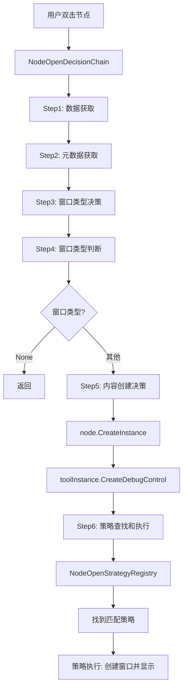
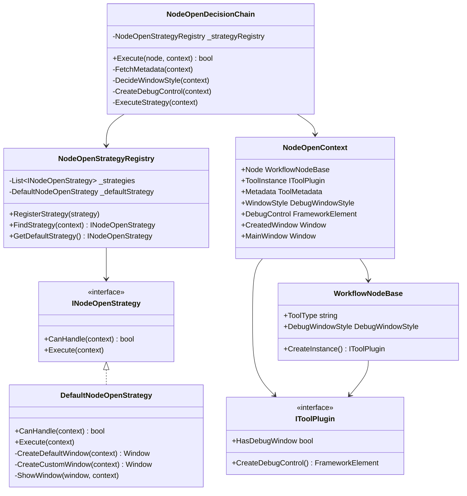

# 🎯 新的调试窗口框架设计

## 📋 设计概述

新的调试窗口框架采用了**责任链模式**和**策略模式**的组合设计，实现了清晰的职责分离和高度的可扩展性。框架的核心思想是：

> **工具只负责创建内容，框架负责创建窗口**

## 🏗️ 架构设计

### 核心组件



### 关键类图



## 🔄 完整工作流程

### 1. 决策链执行流程

**文件**: `src/Workflow/Nodes/NodeOpenDecisionChain.cs`

```csharp
public bool Execute(WorkflowNodeBase node, NodeOpenContext context)
{
    try
    {
        // Step 1: 数据获取
        context.Node = node;
        
        // Step 2: 元数据获取
        FetchMetadata(context);
        
        // Step 3: 窗口类型决策
        DecideWindowStyle(context);
        
        // Step 4: 窗口类型判断
        if (context.WindowStyle == DebugWindowStyle.None)
            return true;
        
        // Step 5: 内容创建决策
        CreateDebugControl(context);
        
        // Step 6: 策略查找和执行
        ExecuteStrategy(context);
        
        return true;
    }
    catch (Exception ex)
    {
        VisionLogger.Instance.Log(LogLevel.Error, 
            $"节点打开失败: {ex.Message}", 
            "NodeOpenDecisionChain", ex);
        return false;
    }
}
```

### 2. 关键步骤详解

#### Step 1: 数据获取
- 将节点引用保存到上下文
- 记录日志

#### Step 2: 元数据获取
```csharp
private void FetchMetadata(NodeOpenContext context)
{
    var metadata = ToolRegistry.GetToolMetadata(node.ToolType);
    context.Metadata = metadata;
    
    if (metadata != null)
        LogSuccess($"获取工具元数据成功: {metadata.DisplayName}");
    else
        LogWarning($"未找到工具元数据: {node.ToolType}");
}
```

#### Step 3: 窗口类型决策
**优先级**: 节点级配置 → 工具级配置 → 全局默认值

```csharp
private void DecideWindowStyle(NodeOpenContext context)
{
    var node = context.Node;
    var metadata = context.Metadata;

    // 优先级1：节点级配置
    if (node.DebugWindowStyle != DebugWindowStyle.Default)
    {
        context.WindowStyle = node.DebugWindowStyle;
        return;
    }

    // 优先级2：工具级配置
    if (metadata?.DebugWindowStyle != DebugWindowStyle.Default)
    {
        context.WindowStyle = metadata.DebugWindowStyle;
        return;
    }

    // 优先级3：全局默认值
    context.WindowStyle = DebugWindowStyle.Default;
}
```

#### Step 4: 窗口类型判断
- 如果窗口类型为 `None`，直接返回，不打开窗口

#### Step 5: 内容创建决策
**核心修改**: `WorkflowNode.CreateInstance()` 方法

```csharp
// 旧实现（抛出异常）
public virtual IToolPlugin? CreateInstance()
{
    throw new NotImplementedException($"Tool type '{ToolType}' is not implemented.");
}

// 新实现（调用 ToolRegistry）
public virtual IToolPlugin? CreateInstance()
{
    // 从工具注册表创建工具实例
    var instance = ToolRegistry.CreateToolInstance(ToolType);
    
    if (instance == null)
    {
        VisionLogger.Instance.Log(LogLevel.Warning, 
            $"无法创建工具实例: ToolType={ToolType}", 
            "WorkflowNodeBase");
    }
    
    return instance;
}
```

**调用调试控件创建**:
```csharp
private void CreateDebugControl(NodeOpenContext context)
{
    var node = context.Node;
    
    // 创建工具实例
    var toolInstance = node.CreateInstance();
    context.ToolInstance = toolInstance;
    
    if (toolInstance == null)
    {
        LogWarning($"无法创建工具实例: {node.ToolType}");
        return;
    }
    
    // 调用 CreateDebugControl 方法
    var debugControl = toolInstance.CreateDebugControl();
    context.DebugControl = debugControl;
    
    if (debugControl != null)
        LogSuccess($"创建调试控件成功: {debugControl.GetType().Name}");
    else
        LogInfo($"工具未提供调试控件: {node.ToolType}");
}
```

#### Step 6: 策略查找和执行
```csharp
private void ExecuteStrategy(NodeOpenContext context)
{
    var strategy = _strategyRegistry.FindStrategy(context);
    
    if (strategy != null)
    {
        LogInfo($"使用策略: {strategy.GetType().Name}");
        strategy.Execute(context);
    }
    else
    {
        LogWarning("未找到合适的策略，使用默认策略");
        _strategyRegistry.GetDefaultStrategy().Execute(context);
    }
}
```

### 3. 策略执行流程

**默认策略**: `DefaultNodeOpenStrategy`

```csharp
public void Execute(NodeOpenContext context)
{
    // 检查调试控件
    if (context.DebugControl == null)
    {
        LogWarning("调试控件为空，无法创建窗口");
        return;
    }

    // 检查控件是否已经是 Window 类型
    if (context.DebugControl is Window existingWindow)
    {
        ShowWindow(existingWindow, context);
        return;
    }

    // 根据窗口类型创建窗口
    Window? window = null;
    switch (context.WindowStyle)
    {
        case DebugWindowStyle.Default:
            window = CreateDefaultWindow(context);
            break;

        case DebugWindowStyle.Custom:
            window = CreateCustomWindow(context);
            break;

        default:
            window = CreateDefaultWindow(context);
            break;
    }

    // 显示窗口
    if (window != null)
        ShowWindow(window, context);
}
```

## 🎨 窗口样式

### DebugWindowStyle 枚举

**文件**: `src/Plugin.SDK/Core/DebugWindowStyle.cs`

```csharp
public enum DebugWindowStyle
{
    /// <summary>
    /// 无窗口 - 不打开任何窗口
    /// </summary>
    /// <remarks>
    /// 适用于不需要调试界面的工具（如纯数据流节点）。
    /// </remarks>
    None,

    /// <summary>
    /// 标准窗口 - 有标题栏和边框
    /// </summary>
    /// <remarks>
    /// 适用于大多数工具的默认窗口样式。
    /// 标准的 WPF 窗口，包含标题栏、边框、最小化/最大化/关闭按钮。
    /// </remarks>
    Default,

    /// <summary>
    /// 自定义窗口 - 无边框圆角窗口
    /// </summary>
    /// <remarks>
    /// 适用于需要特殊视觉效果的工具。
    /// 无边框窗口，带有圆角和自定义样式。
    /// </remarks>
    Custom
}
```

### 窗口类型优先级

```
节点级配置
    ↓
工具级配置 (ToolMetadata.DebugWindowStyle)
    ↓
全局默认值
```

## 📝 使用示例

### 1. 工具实现

**文件**: `tools/SunEyeVision.Tool.Threshold/ThresholdTool.cs`

```csharp
[Tool(
    id: "threshold",
    displayName: "图像阈值化",
    Description = "将灰度图像转换为二值图像",
    Icon = "📷",
    Category = "图像处理",
    Version = "2.0.0",
    HasDebugWindow = true
)]
public class ThresholdTool : IToolPlugin<ThresholdParameters, ThresholdResults>
{
    /// <summary>
    /// 执行工具
    /// </summary>
    public ThresholdResults Run(Mat image, ThresholdParameters parameters)
    {
        // ... 执行逻辑 ...
    }
    
    /// <summary>
    /// 创建调试控件
    /// </summary>
    public FrameworkElement? CreateDebugControl()
    {
        return new ThresholdToolDebugControl();
    }
}
```

### 2. 调试控件实现

**文件**: `tools/SunEyeVision.Tool.Threshold/Views/ThresholdToolDebugControl.xaml.cs`

```csharp
/// <summary>
/// 阈值化工具调试控件 - 普通UserControl架构
/// </summary>
/// <remarks>
/// 架构优化：
/// - 不继承基类，作为普通UserControl
/// - 直接持有参数引用，零拷贝实时同步
/// - 直接绑定到参数对象，不经过 ViewModel 中转
/// - 使用项目样式系统统一外观
/// </remarks>
public partial class ThresholdToolDebugControl : UserControl
{
    // 参数引用（零拷贝，与 WorkflowNode.Parameters 同一个实例）
    private ThresholdParameters _parameters = null!;
    
    /// <summary>
    /// 关联的工具实例
    /// </summary>
    public IToolPlugin? Tool { get; set; }
    
    /// <summary>
    /// 运行按钮点击事件
    /// </summary>
    public event EventHandler? ExecuteRequested;
    
    /// <summary>
    /// 确认按钮点击事件
    /// </summary>
    public event EventHandler? ConfirmClicked;
}
```

### 3. UI层调用

**文件**: `src/UI/ViewModels/MainWindowViewModel.cs` (示例)

```csharp
// 双击节点时
private void OnNodeDoubleClick(WorkflowNodeBase node)
{
    // 创建决策链
    var decisionChain = new NodeOpenDecisionChain();
    
    // 创建上下文
    var context = new NodeOpenContext(_mainWindow, _imageControl);
    
    // 执行决策链
    bool success = decisionChain.Execute(node, context);
    
    if (success && context.CreatedWindow != null)
    {
        // 窗口已创建并显示
        LogSuccess($"调试窗口已打开: {node.DispName}");
    }
}
```

## 🎯 核心优势

### 1. 职责分离

| 组件 | 职责 |
|------|------|
| **IToolPlugin** | 创建调试控件内容 |
| **NodeOpenDecisionChain** | 决策流程控制 |
| **INodeOpenStrategy** | 窗口创建和显示 |
| **NodeOpenContext** | 数据传递和共享 |

### 2. 扩展性

**添加新的窗口样式**:
1. 在 `DebugWindowStyle` 枚举中添加新样式
2. 在 `DefaultNodeOpenStrategy` 中添加对应的创建方法

**添加新的节点类型策略**:
1. 实现 `INodeOpenStrategy` 接口
2. 在 `NodeOpenStrategyRegistry` 中注册

```csharp
public class LoopNodeOpenStrategy : INodeOpenStrategy
{
    public bool CanHandle(NodeOpenContext context)
    {
        return context.Node.NodeType == NodeType.Loop;
    }
    
    public void Execute(NodeOpenContext context)
    {
        // 特殊的循环节点处理逻辑
    }
}

// 注册策略
_strategyRegistry.RegisterStrategy(new LoopNodeOpenStrategy());
```

### 3. 可测试性

每个组件都可以独立测试：
- `NodeOpenDecisionChain` 可以注入 mock 策略
- `INodeOpenStrategy` 实现可以独立测试
- `NodeOpenContext` 是纯数据类，易于构造

### 4. 零拷贝参数同步

调试控件直接引用节点的参数对象：
```csharp
// 调试控件中
private ThresholdParameters _parameters = null!; // 与 WorkflowNode.Parameters 同一个实例

// 修改参数时，零拷贝实时同步
_thresholdSlider.Value = _parameters.Threshold;
```

## 🔄 与旧架构对比

| 对比项 | 旧架构 | 新架构 |
|--------|--------|--------|
| **工具创建实例** | ❌ 抛出异常 | ✅ 调用 ToolRegistry |
| **窗口创建** | ❌ 工具负责创建窗口 | ✅ 框架负责创建窗口 |
| **职责分离** | ❌ 混乱 | ✅ 清晰 |
| **扩展性** | ❌ 难以扩展 | ✅ 易于扩展 |
| **可测试性** | ❌ 难以测试 | ✅ 易于测试 |
| **参数同步** | ❌ 需要拷贝 | ✅ 零拷贝引用 |

## 📊 性能优势

### 1. 按需创建
- 只在双击节点时创建工具实例和调试控件
- 不占用启动时的资源

### 2. 零拷贝参数
- 调试控件直接引用节点的参数对象
- 避免参数拷贝开销
- 实时同步参数修改

### 3. 轻量级上下文
- `NodeOpenContext` 只包含必要的数据
- 决策链执行完毕后即可释放

## 🚀 最佳实践

### 1. 工具实现建议

✅ **推荐**:
```csharp
public FrameworkElement? CreateDebugControl()
{
    // 返回轻量级的 UserControl
    return new ThresholdToolDebugControl();
}
```

❌ **不推荐**:
```csharp
public FrameworkElement? CreateDebugControl()
{
    // 不要在创建控件时执行耗时操作
    var control = new ThresholdToolDebugControl();
    control.LoadHeavyData(); // ❌ 不推荐
    return control;
}
```

### 2. 调试控件设计建议

✅ **推荐**:
```csharp
// 直接引用参数对象，零拷贝
private ThresholdParameters _parameters = null!;

// 在构造函数中初始化UI
public ThresholdToolDebugControl()
{
    InitializeComponent();
    InitializeUI();
}
```

❌ **不推荐**:
```csharp
// 不要拷贝参数
private ThresholdParameters _parametersCopy;

public ThresholdToolDebugControl(ThresholdParameters parameters)
{
    _parametersCopy = parameters.Clone(); // ❌ 不推荐拷贝
}
```

### 3. 日志记录建议

✅ **推荐**:
```csharp
// 使用项目日志系统
VisionLogger.Instance.Log(LogLevel.Info, 
    $"创建调试控件成功: {debugControl.GetType().Name}", 
    "NodeOpenDecisionChain");
```

❌ **不推荐**:
```csharp
// 不要使用 Debug.WriteLine
System.Diagnostics.Debug.WriteLine("创建调试控件"); // ❌ 禁止
```

## 📚 相关文件

### 核心文件
- `src/Workflow/Nodes/NodeOpenDecisionChain.cs` - 决策链
- `src/Workflow/Nodes/NodeOpenContext.cs` - 上下文
- `src/Workflow/Nodes/NodeOpenStrategyRegistry.cs` - 策略注册表
- `src/Workflow/Nodes/INodeOpenStrategy.cs` - 策略接口
- `src/Workflow/Nodes/Strategies/DefaultNodeOpenStrategy.cs` - 默认策略
- `src/Plugin.SDK/Core/IToolPlugin.cs` - 工具接口
- `src/Plugin.SDK/Core/DebugWindowStyle.cs` - 窗口样式枚举
- `src/Workflow/WorkflowNode.cs` - 节点基类

### 示例实现
- `tools/SunEyeVision.Tool.Threshold/ThresholdTool.cs` - 工具实现
- `tools/SunEyeVision.Tool.Threshold/Views/ThresholdToolDebugControl.xaml.cs` - 调试控件

## 🎯 总结

新的调试窗口框架通过**责任链模式**和**策略模式**的组合，实现了：

1. ✅ **职责分离**: 工具创建内容，框架创建窗口
2. ✅ **扩展性强**: 易于添加新的窗口样式和节点类型
3. ✅ **可测试性**: 每个组件可独立测试
4. ✅ **性能优化**: 零拷贝参数同步
5. ✅ **统一规范**: 所有工具遵循相同的接口和流程

这个设计完全符合视觉软件的风格，遵循了项目的编码规范，并且充分考虑了可维护性和可扩展性。

---

**文档版本**: v1.0  
**创建日期**: 2026-04-04  
**最后更新**: 2026-04-04  
**维护者**: 开发团队
